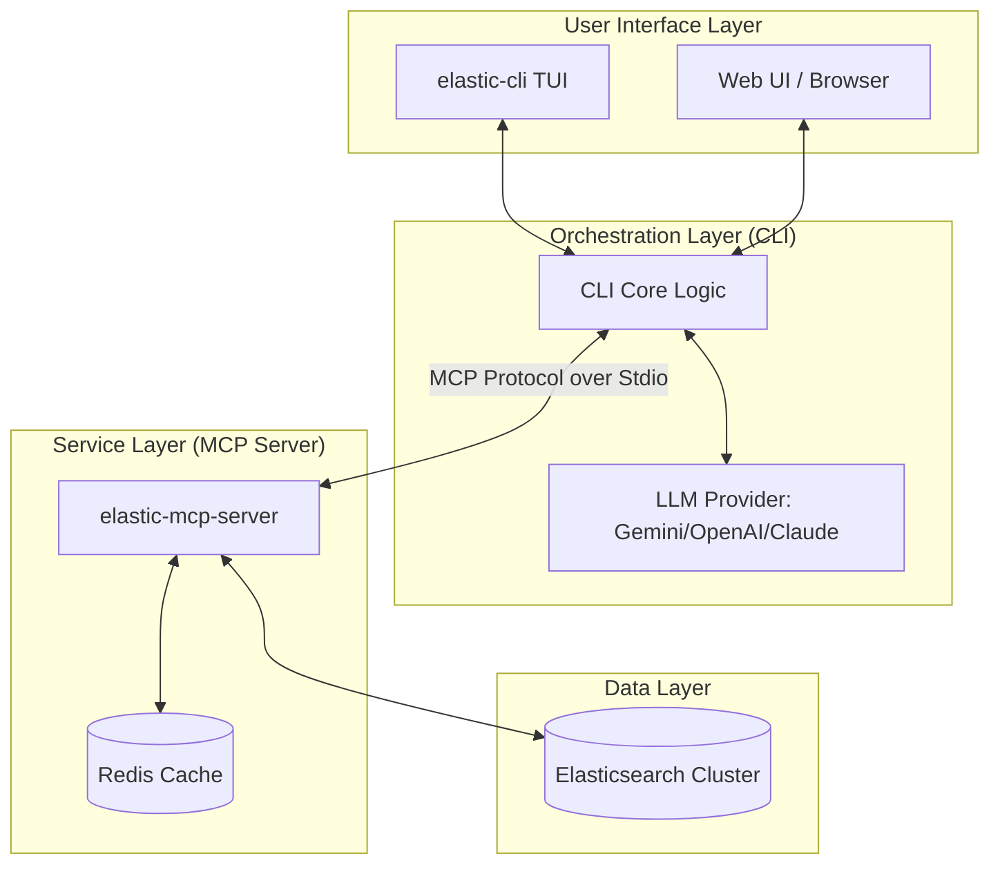

# Architecture: Elastic Security MCP

This document describes the architectural components and data flow of the Elastic Security MCP project.

## High-Level Overview

The system is composed of two primary components: an **MCP Server** that interfaces with Elasticsearch and a **CLI Tool** that acts as an MCP client and provides a user interface (TUI and Web UI) for interacting with LLMs.

## Components

### 1. Elastic MCP Server (`cmd/server`)
The core service implementing the Model Context Protocol. It exposes tools that the LLM can use to query security data.
- **Tool Registration**: Defines the JSON schema and handlers for tools like `search_security_events`, `list_indices`, etc.
- **Elasticsearch Client**: Handles authentication and execution of queries against the Elastic cluster.
- **Caching (`internal/elasticsearch/cache.go`)**: Uses Redis to store tool results and index security entities (IPs, domains) extracted from search results.
- **Normalization**: Ensures that queries are properly formatted for Elasticsearch.

### 2. Elastic CLI (`cmd/cli`)
The primary entry point for users. It manages the conversation loop with the LLM and hosts the user interface.
- **LLM Integration (`internal/llm`)**: Abstracts communication with different LLM providers using `LangChainGo`.
- **Conversation Loop**: Manages the multi-turn interaction between the user, the LLM, and the MCP tools.
- **TUI**: A terminal-based UI built with the `Bubble Tea` framework.
- **Web UI (`internal/webui`)**: An optional browser-based interface provided via a local WebSocket server.

### 3. Shared Logic (`internal/`)
- **`internal/elasticsearch`**: Core Elasticsearch operations and tool implementations.
- **`internal/util`**: Common utilities for logging, JSON manipulation, and string formatting.

## Data Flow

1. **User Input**: The user asks a question via the CLI or Web UI.
2. **LLM Analysis**: The CLI sends the query and tool definitions to the LLM.
3. **Tool Call**: The LLM decides to call a tool (e.g., `search_security_events`).
4. **MCP Request**: The CLI sends an MCP `call_tool` request to the MCP Server over stdio.
5. **Execution**:
    - The MCP Server checks the Redis cache.
    - If not cached, it executes the query against Elasticsearch.
    - Results are normalized, truncated if necessary, and returned to the CLI.
6. **Passive Indexing**: If the result contains security indicators (like DNS data), the MCP Server indexes them in Redis for later use by `lookup_domain` or `lookup_ip`.
7. **Final Response**: The LLM receives the tool results and generates a natural language response for the user.

## Design Principles

- **Separation of Concerns**: The MCP Server knows how to talk to Elasticsearch but doesn't know about LLMs. The CLI knows how to talk to LLMs and MCP servers but doesn't know the internals of Elasticsearch.
- **Protocol-First**: Communication between the CLI and Server follows the Model Context Protocol strictly, allowing either component to be replaced by other MCP-compatible tools.
- **Performance**: Heavy use of Redis caching and result truncation ensures that the system remains responsive and stays within LLM context limits.
