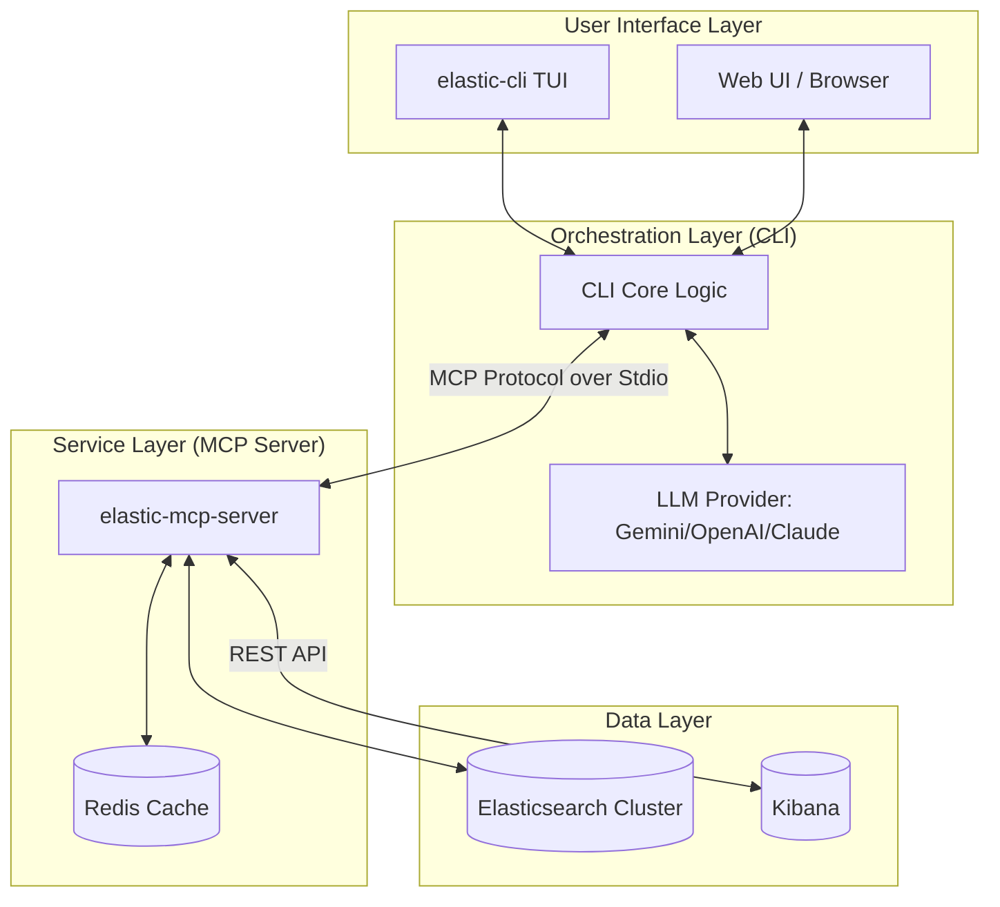

# Architecture: Elastic Security MCP

This document describes the architectural components and data flow of the Elastic Security MCP project.

## High-Level Overview

The system is composed of two primary components: an **MCP Server** that interfaces with Elasticsearch and Kibana, and a **CLI Tool** that acts as an MCP client and provides a user interface (TUI and Web UI) for interacting with LLMs.

```mermaid
graph TD
    subgraph "User Interface Layer"
        CLI[elastic-cli TUI]
        WebUI[Web UI / Browser]
    end

    subgraph "Orchestration Layer (CLI)"
        LLM[LLM Provider: Gemini/OpenAI/Claude]
        CLI_Core[CLI Core Logic]
    end

    subgraph "Service Layer (MCP Server)"
        MCP_Server[elastic-mcp-server]
        Redis[(Redis Cache)]
    end

    subgraph "Data Layer"
        ES[(Elasticsearch Cluster)]
        KB[(Kibana)]
    end

    CLI <--> CLI_Core
    WebUI <--> CLI_Core
    CLI_Core <--> LLM
    CLI_Core <--> |MCP Protocol over Stdio| MCP_Server
    MCP_Server <--> Redis
    MCP_Server <--> ES
    MCP_Server <--> |REST API| KB
```

## Components

### 1. Elastic MCP Server (`cmd/server`)
The core service implementing the Model Context Protocol. It exposes tools that the LLM can use to query security data. The server enforces a **single-instance lock** (via a PID lock file) to prevent duplicate processes when spawned by MCP clients.

- **Tool Registration**: Defines the JSON schema and handlers for all tools (see below). Tools are split across two packages.
- **Elasticsearch Client** (`internal/elasticsearch/client.go`): Handles authentication and execution of queries against the Elastic cluster. Uses both the raw and typed API clients.
- **Kibana Client** (`internal/kibana/client.go`): Optional REST client for Kibana API calls, enabled when `KIBANA_URL` is set.
- **Caching** (`internal/elasticsearch/cache.go`): Uses Redis to store tool results (keyed by SHA-256 of tool name + args) and to index security entities (IPs, domains) extracted from search results.
- **Passive Indexing** (`internal/elasticsearch/indexer.go`): Extracts DNS records from Zeek search results and writes them to Redis sorted sets, powering the `lookup_domain` and `lookup_ip` tools.
- **Normalization** (`internal/util/normalization.go`): Normalizes and validates JSON query input before forwarding to Elasticsearch.
- **Timeouts**: Configurable per-tool timeout (`TOOL_TIMEOUT_SECS`, default 30s), plus dedicated longer timeouts for the export tool (`EXPORT_TIMEOUT_SECS`, default 30m; `EXPORT_BATCH_TIMEOUT_SECS`, default 180s).

#### Elasticsearch Tools (`internal/elasticsearch`)

| Tool | Description |
|------|-------------|
| `list_indices` | Lists cluster indices with doc counts, size, and health |
| `cluster_health` | Returns cluster health status at cluster/indices/shards level |
| `search_security_events` | ECS-style structured search for network + endpoint events (Zeek, Suricata, Packetbeat, Elastic Agent). Requires at least one filter. Results are cached and passively indexed into Redis. |
| `export_security_events` | Scroll-based bulk export to JSONL files with size-based rolling and MCP progress notifications |
| `search_security_alerts` | Searches `.alerts-security.alerts-*` with severity/rule/host filters |
| `search_processes` | Typed search of `logs-endpoint.events.process-*` with process/parent/user/hash filters |
| `lookup_domain` | Fast Redis lookup of 24h DNS history for a domain |
| `lookup_ip` | Fast Redis lookup of 24h DNS history for an IP |
| `search_elastic` | Raw Elasticsearch Query DSL fallback for advanced queries |

#### Kibana Tools (`internal/kibana`)

Registered only when `KIBANA_URL` is set.

| Tool | Description |
|------|-------------|
| `kibana_api_request` | Execute arbitrary HTTP requests against the Kibana REST API |
| `list_kibana_spaces` | List all Kibana spaces |
| `list_detection_rules` | Paginated list of Elastic Security detection rules |
| `get_detection_rule` | Fetch a specific rule by `id` or `rule_id` |
| `list_agents` | List Elastic Agents from Fleet with optional KQL filtering |

### 2. Elastic CLI (`cmd/cli`)
The primary entry point for users. It manages the conversation loop with the LLM and hosts the user interface.

- **LLM Integration** (`internal/llm`): Abstracts communication with different LLM providers using `LangChainGo`. Includes a custom Gemini client (`gemini_model.go`) with thought-signature support and rate-limit retry logic (`internal/util/retry.go`).
- **Conversation Loop**: Manages the multi-turn interaction between the user, the LLM, and the MCP tools. Applies exponential backoff on LLM rate-limit errors.
- **TUI**: A terminal-based UI built with the `Bubble Tea` framework, featuring a scrollable viewport, input history (persisted to disk), and live spinner feedback.
- **Web UI** (`internal/webui`): An optional browser-based interface provided via a local WebSocket server.
- **One-Shot Mode**: The `--prompt`/`-p` flag runs a single query non-interactively and exits, suitable for scripting.
- **MCP Client**: Spawns `elastic-mcp-server` as a subprocess and communicates via the MCP stdio transport using the official `go-sdk`.

### 3. Smoke-Test Client (`cmd/test-mcp`)
A minimal MCP client used for integration testing. Connects to the server and verifies tool availability without the full CLI stack.

### 4. Shared Logic (`internal/`)

| Package | Contents |
|---------|----------|
| `internal/elasticsearch` | Core ES operations: search, alerts, processes, export, caching, passive indexer |
| `internal/kibana` | Kibana REST client and tool implementations |
| `internal/llm` | Custom Gemini model adapter with thought-signature and retry support |
| `internal/util` | Logging helpers, JSON normalization, rate-limit retry, string utilities |
| `internal/webui` | WebSocket server and browser UI assets |

## Data Flow

1. **User Input**: The user asks a question via the CLI or Web UI.
2. **LLM Analysis**: The CLI sends the query and tool definitions to the LLM provider.
3. **Tool Call**: The LLM decides to call a tool (e.g., `search_security_events`).
4. **MCP Request**: The CLI sends an MCP `call_tool` request to the MCP Server over stdio.
5. **Cache Check**: The MCP Server checks Redis for a cached result (keyed by SHA-256 of tool + args).
6. **Execution**: On cache miss, the server executes the query against Elasticsearch (or Kibana). Results are normalized and truncated if necessary to stay within `MAX_RESPONSE_CHARS`.
7. **Passive Indexing**: If the result contains DNS data (e.g., from Zeek), the server asynchronously indexes IPs and domains into Redis sorted sets for later use by `lookup_domain` and `lookup_ip`.
8. **Cache Store**: The result is stored in Redis with a tool-specific TTL.
9. **Final Response**: The LLM receives the tool results and generates a natural language response for the user.

For `export_security_events`, the flow is similar but uses Elasticsearch's scroll API to paginate through all results, writing JSONL files locally and sending MCP progress notifications back to the client.

## Design Principles

- **Separation of Concerns**: The MCP Server knows how to talk to Elasticsearch/Kibana but doesn't know about LLMs. The CLI knows how to talk to LLMs and MCP servers but doesn't know the internals of Elasticsearch.
- **Protocol-First**: Communication between the CLI and Server follows the Model Context Protocol strictly, allowing either component to be replaced by other MCP-compatible tools (e.g., Claude Desktop, Cursor).
- **Performance**: Heavy use of Redis caching and result truncation ensures that the system remains responsive and stays within LLM context limits.
- **Resilience**: The server uses a PID lock file to prevent duplicate instances. The CLI applies exponential backoff on LLM rate-limit errors. Export failures on individual scroll batches are reported without aborting the entire export.
