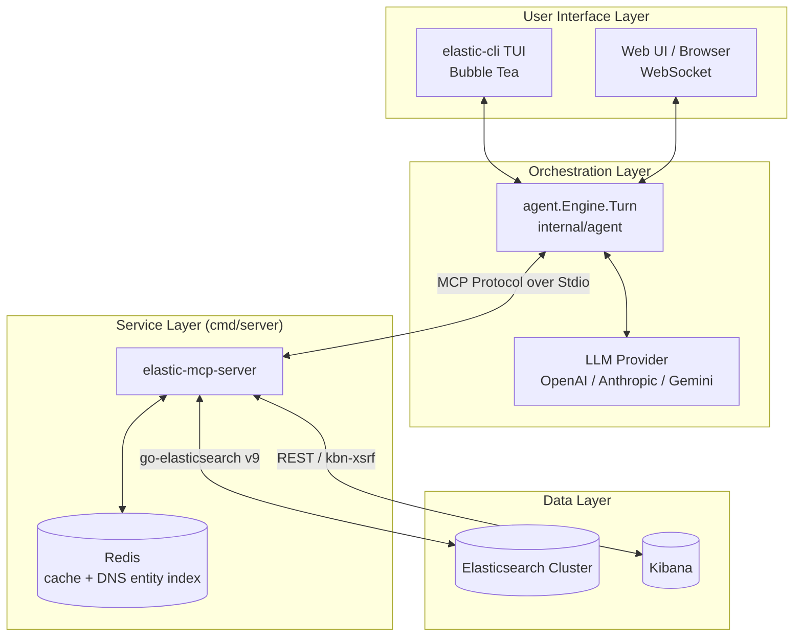
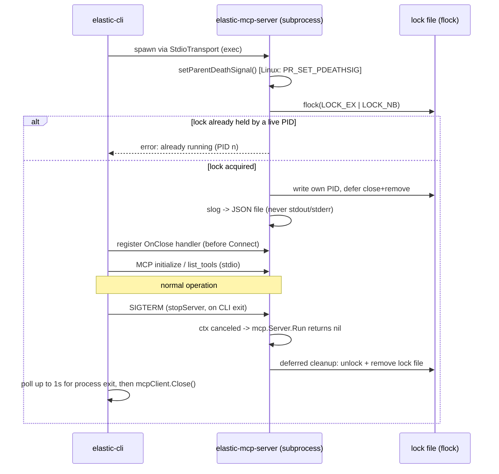
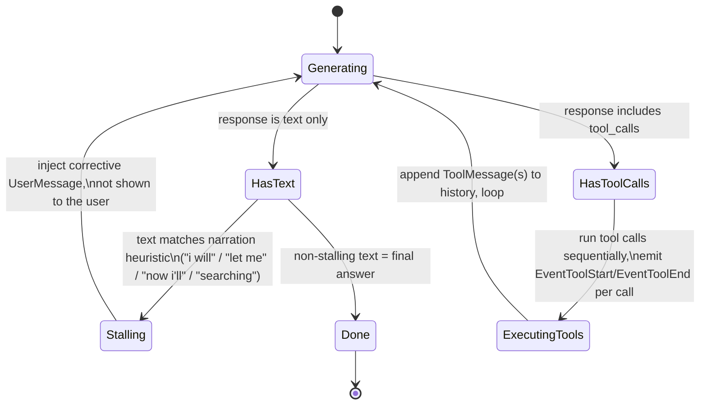
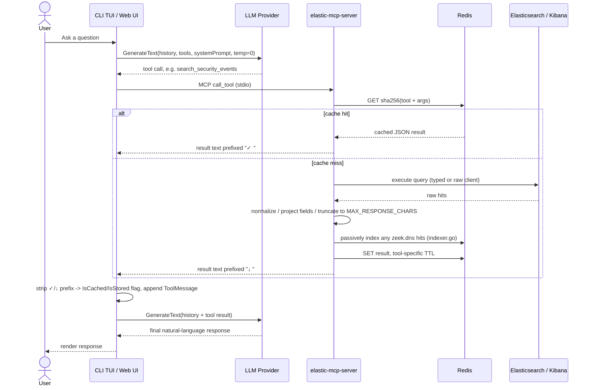
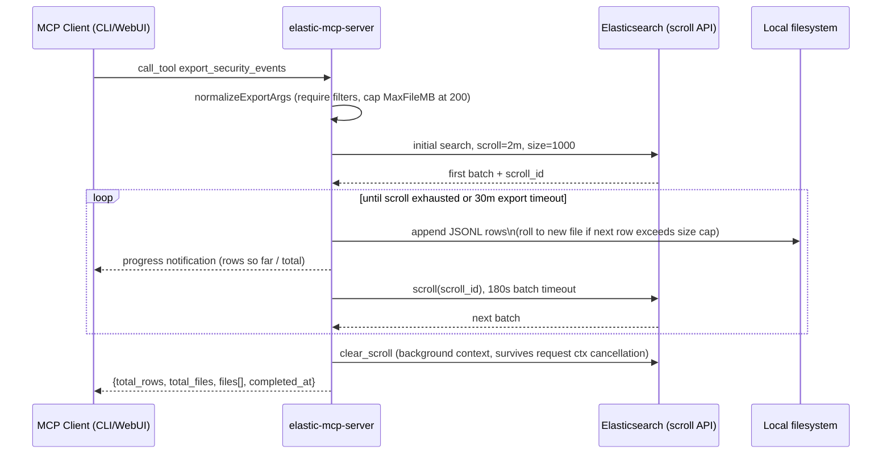

# Architecture: Elastic Security MCP

This document describes the architectural components and data flow of the Elastic Security MCP project. For file-by-file implementation detail, see `cmd/IMPL.md` and `internal/IMPL.md`.

## High-Level Overview

The system is composed of two primary processes: an **MCP Server** that interfaces with Elasticsearch, Kibana, and Redis, and a **CLI** that acts as an MCP client, hosts the LLM conversation loop, and exposes both a terminal UI and a browser-based Web UI.

```mermaid
graph TD
    subgraph "User Interface Layer"
        CLI[elastic-cli TUI\nBubble Tea]
        WebUI[Web UI / Browser\nWebSocket]
    end

    subgraph "Orchestration Layer"
        LLM[LLM Provider\nOpenAI / Anthropic / Gemini]
        Loop[agent.Engine.Turn\ninternal/agent]
    end

    subgraph "Service Layer (cmd/server)"
        MCP_Server[elastic-mcp-server]
        Redis[(Redis\ncache + DNS entity index)]
    end

    subgraph "Data Layer"
        ES[(Elasticsearch Cluster)]
        KB[(Kibana)]
    end

    CLI <--> Loop
    WebUI <--> Loop
    Loop <--> LLM
    Loop <--> |MCP Protocol over Stdio| MCP_Server
    MCP_Server <--> Redis
    MCP_Server <--> |go-elasticsearch v9| ES
    MCP_Server <--> |REST / kbn-xsrf| KB
```

**Note on the orchestration layer**: both the CLI TUI (`cmd/cli/main.go`, Bubble Tea Elm-architecture) and the Web UI (`internal/webui/server.go`, a per-connection goroutine) drive the *same* agentic loop implementation — `agent.Engine.Turn` in `internal/agent` — rather than each re-implementing it. Each front end supplies its own `emit func(agent.Event)` callback that translates engine events into its own UI representation (Bubble Tea messages via a channel for the TUI; `WebMessage`s over the WebSocket for the Web UI). See [Agentic Loop](#agentic-loop--tool-calling) below.

## Components

### 1. Elastic MCP Server (`cmd/server`)

The core service implementing the Model Context Protocol. It exposes tools the LLM can call to query security data, and enforces a **single-instance lock** (PID lock file + `flock`) so a stray second server never runs concurrently with a live one.

- **Tool Registration**: JSON schemas and handlers for all tools, split across `internal/elasticsearch` and `internal/kibana`.
- **Elasticsearch Client** (`internal/elasticsearch/client.go`): API-key auth only; wraps both the raw (`Raw *elasticsearch.Client`) and typed (`Typed *elasticsearch.TypedClient`) `go-elasticsearch/v9` clients from one config.
- **Kibana Client** (`internal/kibana/client.go`): hand-rolled REST client, enabled only when `KIBANA_URL` is set. Supports both API-key and basic auth (API key wins if both present); adds `kbn-xsrf: true` on all non-GET/HEAD requests as Kibana's CSRF protection requires.
- **Caching** (`internal/elasticsearch/cache.go`): Redis-backed, keyed by SHA-256(`toolName + ":" + json(args)`). Cache errors (including Redis being unreachable) are treated as misses and never fail a tool call — caching is strictly best-effort.
- **Passive DNS Indexing** (`internal/elasticsearch/indexer.go`): every `search_elastic`/`search_security_events`/`search_processes` call opportunistically scans its result set for `data_stream.dataset == "zeek.dns"` documents and writes them into Redis sorted sets, powering `lookup_domain`/`lookup_ip`. This runs as a side effect of unrelated tools, not a separate poller.
- **Normalization** (`internal/util/normalization.go`): fixes common LLM-generated JSON mistakes (double-escaped keys) and fails open (passes input through unchanged) on anything it can't parse, before forwarding to Elasticsearch.
- **Timeouts**: three independent tiers, all env-overridable and all only applied if the incoming MCP context has no deadline already: default tool timeout (`TOOL_TIMEOUT_SECS`, 30s), export timeout (`EXPORT_TIMEOUT_SECS`, 30m), export per-scroll-batch timeout (`EXPORT_BATCH_TIMEOUT_SECS`, 180s) so one slow ES batch can't silently consume the whole export budget.
- **Response shaping**: results are pruned of noisy metadata (`_shards`, `timed_out`, per-hit `_index`/`_score`) and truncated proportionally to fit `MAX_RESPONSE_CHARS` (20000 default) before being returned to the LLM.

#### Elasticsearch Tools (`internal/elasticsearch`)

| Tool | Description | Cached? |
|------|-------------|---------|
| `list_indices` | Lists cluster indices with doc counts, size, and health | Yes (`CACHE_LIST_INDICES_TTL`, 3600s) |
| `cluster_health` | Cluster health at cluster/indices/shards level | No |
| `search_security_events` | ECS-style structured search across network + endpoint events (Zeek, Suricata, Packetbeat, Elastic Agent). **Requires at least one filter** (text/time/IP/MAC/domain/URL/dataset) — an unscoped index scan is rejected. | Yes (`CACHE_SEARCH_SECURITY_EVENTS_TTL`, 600s) |
| `export_security_events` | Scroll-based bulk export to JSONL files, size-based file rollover, MCP progress notifications | No (side-effecting) |
| `search_security_alerts` | Searches `.alerts-security.alerts-*` with severity/rule/host filters; `rule_name`/`host` support wildcards transparently | Yes (reuses the security-events TTL — no dedicated alerts TTL) |
| `search_processes` | Typed search of `logs-endpoint.events.process-*` with process/parent/user/hash filters (most fields exact-match only) | **No** — inconsistent with the other three search tools; only its DNS side-effect indexing runs |
| `lookup_domain` | Redis-only lookup of up to 24h/500-entry DNS history for a domain | N/A (Redis is the source of truth) |
| `lookup_ip` | Redis-only lookup of DNS answers + queries seen for an IP | N/A |
| `search_elastic` | Raw Query DSL fallback; auto-retries with `collapse` stripped if ES rejects the collapse field, and warns (doesn't block) on `index: "*"` scatter-gather | Yes (`CACHE_SEARCH_ELASTIC_TTL`, 600s) |

#### Kibana Tools (`internal/kibana`)

Registered only when `KIBANA_URL` is set. Unlike the Elasticsearch tools, these do **not** wrap handlers in panic recovery, and HTTP errors (4xx/5xx) are surfaced as text-prefixed content rather than a Go `error` — see Design Principles.

| Tool | Description |
|------|-------------|
| `kibana_api_request` | Execute arbitrary HTTP requests against the Kibana REST API |
| `list_kibana_spaces` | List all Kibana spaces |
| `list_detection_rules` | Paginated list of Elastic Security detection rules (pagination params are passed through unvalidated — no server-side default/cap despite the tool's documented schema) |
| `get_detection_rule` | Fetch a specific rule by `id` or `rule_id` |
| `list_agents` | List Elastic Agents from Fleet with optional KQL filtering |

#### Server process lifecycle

```mermaid
sequenceDiagram
    participant CLI as elastic-cli
    participant Server as elastic-mcp-server (subprocess)
    participant Lock as lock file (flock)

    CLI->>Server: spawn via StdioTransport (exec)
    Server->>Server: setParentDeathSignal() [Linux: PR_SET_PDEATHSIG]
    Server->>Lock: flock(LOCK_EX | LOCK_NB)
    alt lock already held by a live PID
        Server-->>CLI: error: already running (PID n)
    else lock acquired
        Server->>Lock: write own PID, defer close+remove
        Server->>Server: slog -> JSON file (never stdout/stderr)
        CLI->>Server: register OnClose handler (before Connect)
        CLI->>Server: MCP initialize / list_tools (stdio)
        Note over CLI,Server: normal operation
        CLI->>Server: SIGTERM (stopServer, on CLI exit)
        Server->>Server: ctx canceled -> mcp.Server.Run returns nil
        Server->>Lock: deferred cleanup: unlock + remove lock file
        CLI->>CLI: poll up to 1s for process exit, then mcpClient.Close()
    end
```

`stopServer` in `cmd/cli/main.go` deliberately sends `SIGTERM` and waits (rather than letting `StdioTransport.Close()` `SIGKILL` the child immediately) specifically so the server's deferred lock-file cleanup gets a chance to run.

### 2. Elastic CLI (`cmd/cli`)

The primary entry point. Resolves an LLM provider/model, spawns the MCP server, and drives one of three modes: interactive TUI (default), Web UI (`--webui`), or one-shot (`--prompt`).

- **LLM Integration**: uses the `goai` SDK (`github.com/zendev-sh/goai`) directly — there is no `internal/llm` abstraction package; provider selection is a simple prefix match (`modelProvider`: `gpt-`/`o1-`/`o3-` → OpenAI, `claude-` → Anthropic, `gemini-` → Google) done inline in `setupApp`. If no `--model`/`ELASTIC_MODEL` is given, an interactive Bubble Tea picker lets the user choose a provider (only offered if more than one API key is present) and model.
- **Rate-limit retry** (`internal/util/retry.go`): `WithRetry` wraps every `goai.GenerateText` call (from inside `agent.Engine.Turn`); retries only on string-matched rate-limit errors (`"429"`, `"rate limit"`, `"too many requests"`, `"overloaded"`), backoff doubling from 2s up to 5 retries (~62s total), then one final attempt.
- **Observability** (`internal/llmobs`): `Hooks()` logs request/response metadata (latency, token usage, finish reason) around every `GenerateText` call. goai's *tool-level* hooks are never used — the `goai.Tool` values built here have no `Execute` closure, so tool dispatch (calling the MCP server and feeding results back) is done manually inside `agent.Engine.Turn`, not by the SDK.
- **TUI**: Bubble Tea + Lipgloss + Glamour — scrollable viewport, readline-style input history (persisted to `~/.elastic-cli-history`), live spinner, footer with running cache-hit/miss/store and tool-error counters, `/memory` and `/export` slash commands.
- **Web UI** (`internal/webui`): optional local WebSocket server (assets embedded via `//go:embed`); origin check is hardcoded to `localhost`/`127.0.0.1` only. Conversation history is scoped per WebSocket connection (not persisted across reconnects).
- **One-Shot Mode** (`--prompt`/`-p`): runs a single `agent.Engine.Turn` call and exits, printing tool names and the final answer as they're emitted.
- **MCP Client**: spawns `elastic-mcp-server` as a subprocess via `goaimcp.StdioTransport`, registers `OnClose` **before** `Connect` so a server crash cancels pending requests immediately instead of hanging.

#### Agentic Loop / Tool Calling

`agent.Engine.Turn` (`internal/agent/agent.go`) implements the loop once; both the TUI and the Web UI drive it and translate its `Event`s into their own UI:

```mermaid
stateDiagram-v2
    [*] --> Generating
    Generating --> HasToolCalls: response includes tool_calls
    Generating --> HasText: response is text only
    HasText --> Stalling: text matches narration heuristic\n("i will" / "let me" / "now i'll" / "searching")
    Stalling --> Generating: inject corrective UserMessage,\nnot shown to the user
    HasText --> Done: non-stalling text = final answer
    HasToolCalls --> ExecutingTools: run tool calls sequentially,\nemit EventToolStart/EventToolEnd per call
    ExecutingTools --> Generating: append ToolMessage(s) to history, loop
    Done --> [*]
```

The loop has no iteration cap on the stalling-retry path — a persistently narration-prone model response could loop indefinitely. Tool calls always execute sequentially, never in parallel.

Each front end supplies its own `emit func(agent.Event)`:
- **Web UI** (`internal/webui/server.go`): `emitEvent` calls `sendMessage` synchronously inside the same per-connection goroutine that's already blocking on `Turn` — no extra plumbing needed, since nothing else needs that goroutine in the meantime.
- **CLI TUI** (`cmd/cli/main.go`): `startTurn` runs `Turn` in a background goroutine (Bubble Tea's `Update` must stay single-threaded and non-blocking) whose `emit` pushes each `agent.Event` onto a buffered channel; a repeating `tea.Cmd` (`waitForAgentEvent`) drains one event at a time, so the TUI renders each tool call's start/finish as it happens instead of waiting for the whole turn to complete — this is what previously made the Web UI feel more responsive than the CLI, before the loop was unified.

#### Tool call lifecycle (cache + passive indexing)

```mermaid
sequenceDiagram
    actor User
    participant UI as CLI TUI / Web UI
    participant LLM as LLM Provider
    participant MCP as elastic-mcp-server
    participant Cache as Redis
    participant ES as Elasticsearch / Kibana

    User->>UI: Ask a question
    UI->>LLM: GenerateText(history, tools, systemPrompt, temp=0)
    LLM-->>UI: tool call, e.g. search_security_events
    UI->>MCP: MCP call_tool (stdio)
    MCP->>Cache: GET sha256(tool + args)
    alt cache hit
        Cache-->>MCP: cached JSON result
        MCP-->>UI: result text prefixed "✓ "
    else cache miss
        MCP->>ES: execute query (typed or raw client)
        ES-->>MCP: raw hits
        MCP->>MCP: normalize / project fields / truncate to MAX_RESPONSE_CHARS
        MCP->>Cache: passively index any zeek.dns hits (indexer.go)
        MCP->>Cache: SET result, tool-specific TTL
        MCP-->>UI: result text prefixed "↓ "
    end
    UI->>UI: strip ✓/↓ prefix -> IsCached/IsStored flag, append ToolMessage
    UI->>LLM: GenerateText(history + tool result)
    LLM-->>UI: final natural-language response
    UI-->>User: render response
```

The `"✓ "` / `"↓ "` text-prefix convention is an implicit contract between `elasticsearch.WrapWithCache` (producer) and both UI loops (consumers) — there is no structured field carrying this signal apart from `Meta["cache_status"]`, which the UIs don't currently read.

#### Export flow (`export_security_events`)

Uses the Elasticsearch **scroll API** rather than `from`/`size`, specifically to avoid the `index.max_result_window` ceiling (10,000 docs by default) that page-based pagination would hit.

```mermaid
sequenceDiagram
    participant Client as MCP Client (CLI/WebUI)
    participant MCP as elastic-mcp-server
    participant ES as Elasticsearch (scroll API)
    participant FS as Local filesystem

    Client->>MCP: call_tool export_security_events
    MCP->>MCP: normalizeExportArgs (require filters, cap MaxFileMB at 200)
    MCP->>ES: initial search, scroll=2m, size=1000
    ES-->>MCP: first batch + scroll_id
    loop until scroll exhausted or 30m export timeout
        MCP->>FS: append JSONL rows\n(roll to new file if next row exceeds size cap)
        MCP-->>Client: progress notification (rows so far / total)
        MCP->>ES: scroll(scroll_id), 180s batch timeout
        ES-->>MCP: next batch
    end
    MCP->>ES: clear_scroll (background context, survives request ctx cancellation)
    MCP-->>Client: {total_rows, total_files, files[], completed_at}
```

### 3. Smoke-Test Client (`cmd/test-mcp`)

A minimal diagnostic client using the raw `go-sdk/mcp` package directly (not `goai`/`goaimcp`): spawns the server, connects, calls `ListTools`, and dumps the tool list as JSON. No LLM involved, no graceful-shutdown handshake with the server (relies on `PR_SET_PDEATHSIG` on Linux as its only safety net if killed abruptly).

### 4. Shared Logic (`internal/`)

| Package | Contents |
|---------|----------|
| `internal/agent` | The shared agentic loop (`Engine.Turn`): LLM calls, stall detection, sequential tool execution, cache-prefix parsing, `SystemPrompt`. Driven by both `cmd/cli` and `internal/webui`. |
| `internal/elasticsearch` | Core ES operations: search, alerts, processes, export, Redis caching, passive DNS indexer, and the shared query-building helpers (`buildTermQuery`'s CIDR/wildcard/term auto-detection, field projection, response shaping/truncation) used by all three search-shaped tools |
| `internal/kibana` | Hand-rolled Kibana REST client and its 5 tool implementations |
| `internal/llmobs` | Request/response logging hooks for `goai.GenerateText` calls (latency, token usage) — tool-level hooks are unused by design, see Agentic Loop above |
| `internal/util` | Logging config/filenames, JSON normalization (LLM-malformed-JSON repair), LLM rate-limit retry with backoff, log-string truncation |
| `internal/webui` | Embedded-asset WebSocket server; translates `internal/agent`'s Events into `WebMessage`s over the connection |

## Data Flow

1. **User Input**: the user asks a question via the CLI TUI or Web UI.
2. **LLM Analysis**: the orchestration layer sends the conversation history and tool schemas to the LLM provider (`Temperature=0`, `MaxOutputTokens=4096`).
3. **Tool Call**: the LLM decides to call a tool (e.g., `search_security_events`).
4. **MCP Request**: an MCP `call_tool` request is sent to the MCP Server over stdio.
5. **Cache Check**: the server checks Redis for a cached result (SHA-256 of tool name + JSON args).
6. **Execution**: on a cache miss, the server executes the query against Elasticsearch (or Kibana). Results are normalized, field-projected, and truncated to stay within `MAX_RESPONSE_CHARS`.
7. **Passive Indexing**: if the result contains Zeek DNS documents, the server indexes the extracted domains/IPs into Redis sorted sets (`dns:name:*`, `dns:ip:*`, `ip:seen:*`, 24h TTL refreshed on every write) for later use by `lookup_domain`/`lookup_ip`.
8. **Cache Store**: the result is stored in Redis with a tool-specific TTL (results are marked `"↓ "` on this path vs `"✓ "` for a hit).
9. **Final Response**: the LLM receives the tool result as a `ToolMessage`, and either calls another tool or produces the final natural-language answer, which is rendered to the user.

For `export_security_events`, the flow instead uses the scroll API to paginate through all matching results, writing size-rolled JSONL files locally and sending MCP progress notifications back to the client throughout (see [Export flow](#export-flow-export_security_events) above).

## Design Principles

- **Separation of Concerns**: the MCP Server knows how to talk to Elasticsearch/Kibana/Redis but nothing about LLMs. The CLI/Web UI know how to talk to LLM providers and MCP servers but not the internals of Elasticsearch queries.
- **Protocol-First**: CLI-to-Server communication follows the Model Context Protocol strictly over stdio, so either side is replaceable by any MCP-compatible client/server (e.g., Claude Desktop, Cursor).
- **Performance**: Redis caching (best-effort, fail-open) and proportional response truncation keep the system responsive and within LLM context limits.
- **Resilience**: a PID lock file prevents duplicate server instances; the CLI applies exponential backoff on LLM rate-limit errors; individual export scroll-batch failures are reported without aborting the whole export; a server subprocess crash cancels pending MCP requests immediately via `OnClose` rather than hanging.
- **One shared loop, two thin adapters**: the agentic tool-calling loop, `SystemPrompt`, and its helper functions live once in `internal/agent` (`Engine.Turn`). `cmd/cli/main.go` and `internal/webui/server.go` each only supply an `emit func(agent.Event)` translating engine events into their own UI's messages — a behavior or prompt fix made in `internal/agent` automatically applies to both front ends, with no risk of the two drifting apart as they previously had.
- **Inconsistent error semantics across tool families**: Elasticsearch tool handlers wrap every call in panic recovery and return a Go `error` on failure; Kibana tool handlers do neither — HTTP 4xx/5xx responses are surfaced only as a text-prefixed string (`"HTTP Error %d:\n..."`), and an unrecovered panic in a Kibana handler would take down the whole server process.
