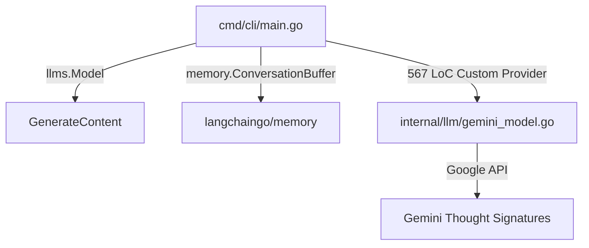
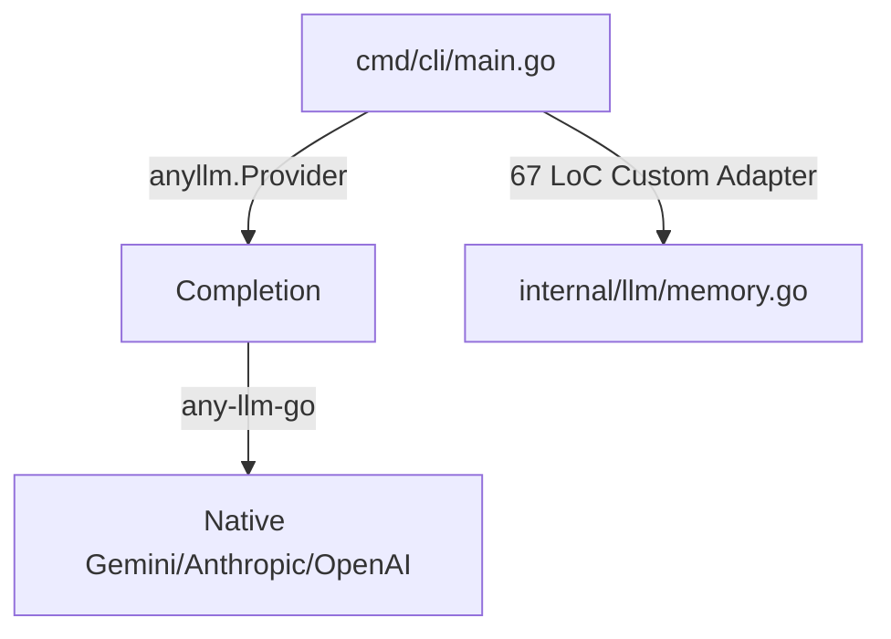
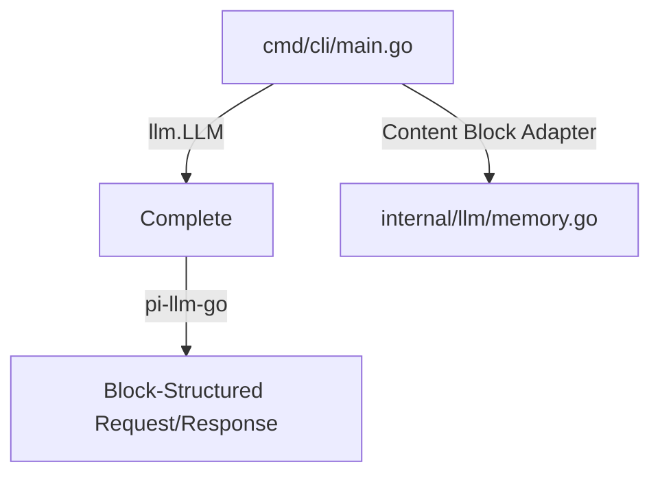
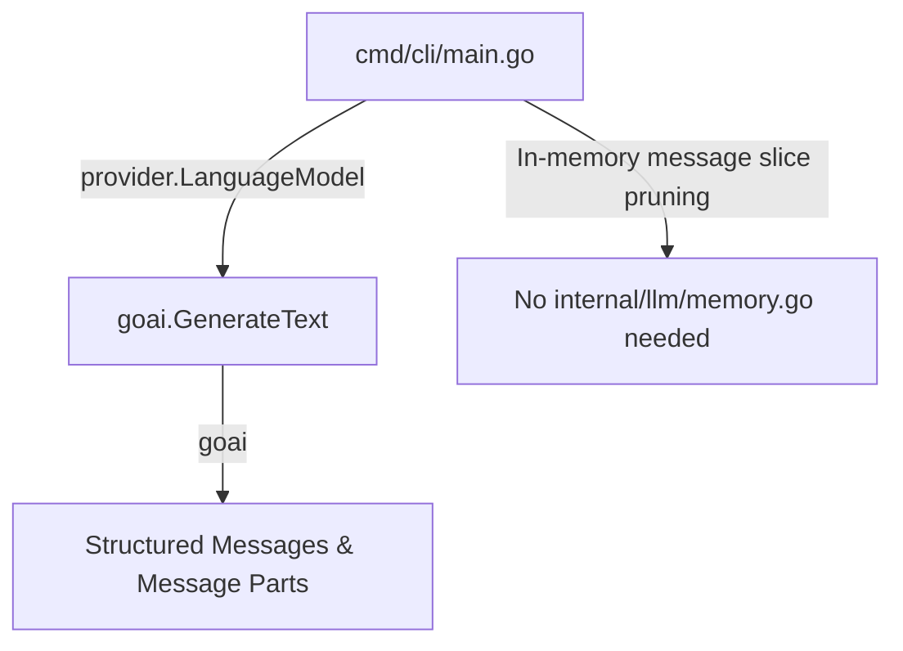

# Go Agent Implementation Comparison: `elastic-security-mcp`

This document provides a comparative analysis of the LLM orchestration, conversation memory, and agent orchestration implementations across the different development branches of `elastic-security-mcp`.

The codebase has evolved through four major architectural paradigms, each using a different Go LLM library or approach:

1. **`main` (Legacy)**: Based on `github.com/tmc/langchaingo`.
2. **`any-llm-go`**: Based on `github.com/mozilla-ai/any-llm-go` (migrated in commit `a59d51e`).
3. **`pi-llm-port`**: Based on `github.com/amit-timalsina/pi-llm-go` (minimalist, block-based API).
4. **`zendev-goai` (Active)**: Based on `github.com/zendev-sh/goai` (modern, part-structured API).

---

## 🗺️ Architectural Topology Comparison

The diagram below shows how the CLI application communicates with the LLM API and handles state across the different branches.

#### `main` branch (`langchaingo`)


#### `any-llm-go` branch


#### `pi-llm-port` branch


#### `zendev-goai` branch (Current)


---

## 🔌 Provider API Analysis

The Provider API defines how the agent establishes sessions, formats prompt requests, and extracts text or tool calls from the model responses.

### 1. `langchaingo` (`main`)
*   **Abstractions**: `llms.Model` interface with `GenerateContent(ctx, messages, options...)`.
*   **Response Structure**: `llms.ContentResponse` containing a list of `Choices`, where each choice has a flat text `Content` field and a separate `ToolCalls` slice.
*   **Gemini Support**: Missing native support for Gemini thought signatures/reasoning processes. The team had to build and maintain a custom model provider wrapper (`geminiModel`) in `internal/llm/gemini_model.go` (567 lines) that directly parsed raw candidate parts via the HTTP API.

### 2. `any-llm-go` (`any-llm-go`)
*   **Abstractions**: `anyllm.Provider` interface with `Completion(ctx, CompletionParams)`.
*   **Response Structure**: `anyllm.ChatCompletion` containing `Choices`, with each choice returning an `anyllm.Message` having a flat `.ContentString()` and a `.ToolCalls` slice.
*   **Gemini Support**: Native wrapper around `google.golang.org/genai`. Supported thought signatures, allowing the deletion of the custom 567 LoC provider file.

### 3. `pi-llm-go` (`pi-llm-port`)
*   **Abstractions**: `llm.LLM` interface with a package-level entry point `llm.Complete(ctx, provider, request)`.
*   **Response Structure**: Highly flat. It completely removes the `Choices` array, returning a single `*llm.Message` containing a slice of content blocks (`[]llm.Block`).
*   **Block-Based Output**: Tool calls and text outputs are not separate fields; they are part of the sequential `Content` slice as `llm.ToolCallBlock` or `llm.TextBlock`.

### 4. `goai` (`zendev-goai`)
*   **Abstractions**: `provider.LanguageModel` interface, orchestrated via a high-level helper `goai.GenerateText(ctx, model, options...)`.
*   **Response Structure**: Returns a `*goai.TextResult`, which wraps the final response text, raw tool calls, and the generated response messages.
*   **Integration Model**: Handlers are cleanly packaged under `provider/openai`, `provider/anthropic`, and `provider/google` (representing Gemini).

---

## 🧠 Memory API Analysis

Conversational history must be preserved, formatted, and pruned during interactive CLI or Web UI sessions to stay within context windows.

### 1. `langchaingo` (`main`)
*   **Approach**: Uses langchaingo's native `memory.ConversationBuffer`.
*   **Integration**: Leverages standard memory interfaces. While convenient, it forces importing the massive `langchaingo` codebase just to retain a buffer of conversation history.
*   **State Format**: Managed via `llms.MessageContent` slices.

### 2. `any-llm-go` (`any-llm-go`)
*   **Approach**: A lightweight, custom `ConversationBuffer` implemented in `internal/llm/memory.go` (67 LoC).
*   **Integration**: Mimics the exact methods of the langchaingo memory buffer (`SaveContext` and `LoadMemoryVariables`) to prevent breaking consumers in the CLI TUI (`cmd/cli/main.go`) and the Web UI server (`internal/webui/server.go`).
*   **State Format**: Managed via slices of `anyllm.Message` containing simple strings.

### 3. `pi-llm-go` (`pi-llm-port`)
*   **Approach**: Custom `ConversationBuffer` in `internal/llm/memory.go` rewritten to utilize `llm.Message` and content block structures.
*   **Integration**: Uses the block-centric API. Text inputs are stored as `llm.TextBlock`s. When loading history, it loops through message content blocks to reconstruct standard role-based transcript segments.
*   **State Format**: Slices of `llm.Message` containing `[]llm.Block`.

### 4. `goai` (`zendev-goai`)
*   **Approach**: Direct in-memory slice manipulation. The codebase **deletes** `internal/llm/memory.go` entirely.
*   **Integration**: Instead of wrapping memory in an abstract buffer object, history is maintained directly in the CLI's Bubble Tea model (`history []provider.Message`) and the Web UI's WebSocket loop (`history []provider.Message`).
*   **State Format**: Slices of `provider.Message` containing `provider.Part` elements (such as `PartText`, `PartToolCall`, and `PartToolResult`).
*   **Pruning**: Implemented procedurally via a simple helper function `pruneHistory()` in the CLI (`cmd/cli/main.go`), keeping the last 15 messages (`maxHistoryMessages`) when memory is disabled. Note: this is an **implementation gap rather than a framework limitation** — the Web UI (`internal/webui/server.go`) currently has *no* pruning and grows history unbounded (`*history = append(*history, result.ResponseMessages...)`). A shared pruning helper would close the gap.

---

## 🤖 Agent API & Loop Orchestration

The agent loop represents the core execution engine: sending the prompt, intercepting tool calls, invoking local MCP commands, posting results back, and preventing loop execution failures (like stalling/narration).

| Branch | Tool Call Representation | Tool Result Handling | Stalling Detection |
| :--- | :--- | :--- | :--- |
| **`main`** | `llms.ToolCall` (nested structure) | `llms.ToolCallResponse` content parts | Procedural check for narrative phrases ("I will search", etc.), appending a direct prompt to force action. |
| **`any-llm-go`** | `anyllm.ToolCall` (function parameters) | `anyllm.Message` with `RoleTool` and `ToolCallID` | Same procedural check, appending instruction to `history` slice. |
| **`pi-llm-port`** | `llm.ToolCallBlock` inside `Message.Content` | `llm.Message` containing `llm.ToolResultBlock` | Same check, wrapping text in `llm.TextBlock`. |
| **`zendev-goai`** | `provider.ToolCall` (integrated slice) | `provider.Message` containing `provider.PartToolResult` parts | Same check, appending user correction messages directly to history. |

In all four implementations, the agent loop itself is **inlined directly within the application layer** (`cmd/cli/main.go` and `internal/webui/server.go`). There is no independent "Agent struct" or separate framework-driven agent runner; orchestration is handled by:
1. Bubble Tea messages (`llmResponseMsg` and `toolsResultMsg` triggers) in the TUI CLI.
2. An infinite loop over WebSocket requests (`processConversation`) in the Web UI.

---

## 💻 Concrete Code Examples

### 1. Provider & Tool Setup Comparison

This snippet demonstrates how tools discovered from the MCP server are converted into each library's native format.

#### `main` (`langchaingo`)
```go
lcTools := make([]llms.Tool, 0, len(toolsResult.Tools))
for _, t := range toolsResult.Tools {
    lcTools = append(lcTools, llms.Tool{
        Type: "function",
        Function: &llms.FunctionDefinition{
            Name:        t.Name,
            Description: t.Description,
            Parameters:  t.InputSchema,
        },
    })
}
```

#### `any-llm-go`
```go
anyTools := make([]anyllm.Tool, 0, len(toolsResult.Tools))
for _, t := range toolsResult.Tools {
    anyTools = append(anyTools, anyllm.Tool{
        Type: "function",
        Function: anyllm.Function{
            Name:        t.Name,
            Description: t.Description,
            Parameters:  convertSchema(t.InputSchema), // requires a schema fixer helper
        },
    })
}
```

#### `pi-llm-port`
```go
tools := make([]llm.Tool, 0, len(toolsResult.Tools))
for _, t := range toolsResult.Tools {
    schemaBytes, _ := json.Marshal(t.InputSchema)
    tools = append(tools, llm.Tool{
        Name:        t.Name,
        Description: t.Description,
        InputSchema: json.RawMessage(schemaBytes), // flattened parameters
    })
}
```

#### `zendev-goai` (Current)
```go
tools := make([]goai.Tool, 0, len(toolsResult.Tools))
for _, t := range toolsResult.Tools {
    tools = append(tools, goai.Tool{
        Name:        t.Name,
        Description: t.Description,
        InputSchema: t.InputSchema, // direct JSON schema mapping
    })
}
```

---

### 2. Completion Request & Execution

This section contrasts how prompt messages, system prompts, temperature controls, and tools are supplied during model invocation.

#### `main` (`langchaingo`)
```go
resp, err := llmClient.GenerateContent(ctx, history, llms.WithTools(lcTools))
choice := resp.Choices[0]
content := choice.Content
```

#### `any-llm-go`
```go
resp, err := llmClient.Completion(ctx, anyllm.CompletionParams{
    Model:    modelName,
    Messages: history,
    Tools:    anyTools,
})
choice := resp.Choices[0]
content := choice.Message.ContentString()
```

#### `pi-llm-port`
```go
resp, err := llm.Complete(ctx, llmClient, llm.Request{
    Model:       modelName,
    System:      systemPrompt,             // system prompt moved out of messages slice
    Messages:    m.history,
    Tools:       m.tools,
    Temperature: &tempZero,
    MaxTokens:   4096,                     // plain int value
})
// Complete returns the message object directly (no choices array wrapper)
```

#### `zendev-goai` (Current)
```go
result, err := goai.GenerateText(m.ctx, m.llmModel,
    goai.WithMessages(m.history...),
    goai.WithSystem(systemPrompt),         // configuration via functional options
    goai.WithTools(m.tools...),
    goai.WithTemperature(0),
    goai.WithMaxOutputTokens(4096),
)
content := result.Text
```

---

### 3. Memory & History Management

How conversation memory and sliding history window pruning are handled in the CLI.

#### `main` (`langchaingo`)
```go
// Loading history from ConversationBuffer
vars, err := m.mem.LoadMemoryVariables(m.ctx, nil)
hist, _ := vars["history"].(string)

// Appending user prompt to structured history
m.history = append(m.history, llms.MessageContent{
    Role:  llms.ChatMessageTypeHuman,
    Parts: []llms.ContentPart{llms.TextContent{Text: input}},
})
```

#### `any-llm-go` (Custom Memory Adapter)
```go
type ConversationBuffer struct {
    mu       sync.Mutex
    messages []anyllm.Message
}

func (cb *ConversationBuffer) SaveContext(ctx context.Context, input map[string]any, output map[string]any) error {
    cb.mu.Lock()
    defer cb.mu.Unlock()
    inStr, _ := input["input"].(string)
    outStr, _ := output["output"].(string)
    if inStr != "" {
        cb.messages = append(cb.messages, anyllm.Message{Role: anyllm.RoleUser, Content: inStr})
    }
    if outStr != "" {
        cb.messages = append(cb.messages, anyllm.Message{Role: anyllm.RoleAssistant, Content: outStr})
    }
    return nil
}
```

#### `pi-llm-port` (Block-based Memory)
```go
func (cb *ConversationBuffer) SaveContext(ctx context.Context, input map[string]any, output map[string]any) error {
    cb.mu.Lock()
    defer cb.mu.Unlock()
    inStr, _ := input["input"].(string)
    outStr, _ := output["output"].(string)
    if inStr != "" {
        cb.messages = append(cb.messages, llm.Message{
            Role:    llm.RoleUser,
            Content: []llm.Block{llm.TextBlock{Text: inStr}}, // block wrapper
        })
    }
    // (similar for AI/Assistant response block)
    return nil
}
```

#### `zendev-goai` (Current - Direct Memory Pruning)
```go
// User prompt is appended directly as a goai message struct
m.history = append(m.history, goai.UserMessage(input))

if !m.useMemory {
    m.pruneHistory()
}

// Slice-based sliding window history pruning in cmd/cli/main.go
func (m *model) pruneHistory() {
    if len(m.history) <= maxHistoryMessages {
        return
    }
    m.history = m.history[len(m.history)-maxHistoryMessages:]
}
```

---

## 📊 Summary Comparison Matrix

| Feature / Metric | `main` (langchaingo) | `any-llm-go` | `pi-llm-port` | `zendev-goai` (Current) |
| :--- | :--- | :--- | :--- | :--- |
| **Orchestration Core** | Framework-based | Lightweight Client | Minimalist Client | Structured Part Client |
| **Module Footprint** (go.mod require entries / go.sum lines) | 62 / 178 (broad API surface, pulls `google.golang.org/api`) | 87 / 239 (heaviest by both metrics) | 60 / 166 (lightest) | 60 / 170 |
| **Dependency Sourcing** | Published (`langchaingo v0.1.14`) | Local `replace` (unpublished checkout) | Local `replace` (unpublished checkout) | Published (`goai v0.8.5`) |
| **Custom Model Wrappers** | Yes (`gemini_model.go`, 567 lines) | No (native wrapper) | No (native wrapper) | No (native wrapper) |
| **Memory Adapter** | Langchaingo library | Custom Adapter (67 LoC) | Custom Adapter (73 LoC) | None (Direct TUI/Web UI slice handling) |
| **System Prompt Delivery**| Prepended to message history | Prepended to message history | Specified in `llm.Request.System` | Passed to `goai.WithSystem()` |
| **Tool Definition Format**| Typed nested structures | Typed nested structures | Flat struct with schema bytes | Flat `goai.Tool` with MCP schema |
| **Web UI Integration** | Websocket / Raw JSON | Websocket / Raw JSON | Websocket / Raw JSON | Websocket / Raw JSON |

---

## 📝 Integration Quality and Developer Velocity Assessment

> **Framework vs. implementation.** The points below separate **framework-inherent** traits (consequences of the library's design that any consumer would hit) from **implementation choices** (decisions made in *this* codebase that could be optimized without changing libraries). Many "cons" attributed to a framework in earlier drafts were really artifacts of how this project wired it up — most could be improved within the same library.

### 1. Langchaingo (`main`)
*   **Framework — Pros**: Standard framework with broad recognition; batteries-included abstractions (`memory.ConversationBuffer`) work out of the box.
*   **Framework — Cons**: At the time of writing it lacked native Gemini thought-signature support. Extracting reasoning traces required dropping to the raw HTTP candidate parts — a genuine library gap, not a wiring choice. Broad API surface pulls heavier transitive deps (e.g. `google.golang.org/api`), though by module count (62) it is *comparable to*, not heavier than, the other branches (see matrix — `any-llm-go` is actually the heaviest). The "vector DB" framing in earlier drafts was incorrect: no vector-DB dependency is present (`alecthomas/chroma` is a syntax highlighter).
*   **Implementation — Cons**: The 567 LoC `gemini_model.go` is partly a consequence of the framework gap, but its size also reflects an implementation choice to fully reimplement a provider rather than wrap a narrower slice. A thinner shim over `google.golang.org/genai` could likely have cut this substantially.

### 2. `any-llm-go`
*   **Framework — Pros**: Solved Gemini thought-signature parsing natively (native wrapper around `google.golang.org/genai`), enabling deletion of the 567 LoC custom provider. Clean OpenAI-style `Completion`/`Choices` shape that most developers already know.
*   **Framework — Cons**: Carries the nested `Function.Parameters` object shape, and its schema handling required a `convertSchema()` fixer helper in this project. Heaviest dependency graph of the four (87 require entries / 239 go.sum lines).
*   **Implementation — Cons**: The custom `ConversationBuffer` (67 LoC) deliberately mirrored the langchaingo interface (`SaveContext`/`LoadMemoryVariables`) to avoid touching consumers — a velocity-preserving choice, but it carried legacy `map[string]any` plumbing forward. The `convertSchema` helper is duplicated at two call sites and could be centralized. Currently consumed via a local `replace` directive (unpublished).

### 3. `pi-llm-port`
*   **Framework — Pros**: Extremely clean, minimal block-based API; lightest dependency graph (60 / 166). Moving the system prompt out of the message array (`Request.System`) aligns with Anthropic/Gemini native shapes. No `Choices` wrapper — a single `*llm.Message` with a `[]llm.Block`.
*   **Framework — Cons**: The block-structured response forces type-switching (`llm.TextBlock` / `llm.ToolCallBlock` / `llm.ToolResultBlock`) at every read site — inherent to the design.
*   **Implementation — Cons**: Required rewriting message helpers (e.g. `summarizeHistoryForLog`) for `[]llm.Block`. The retained `ConversationBuffer` (73 LoC) is heavier than necessary now that the block model could be stored directly. Consumed via a local `replace` directive (unpublished).

### 4. `zendev-goai` (Active Branch)
*   **Framework — Pros**: Strong balance of structure and simplicity. Part-structured `provider.Message`/`provider.Part` model maps cleanly to MCP schemas with no manual conversion (`InputSchema` passed through directly). Functional options (`goai.WithSystem`, `goai.WithTools`, …) read well. Only branch consuming a **published, versioned** module (`goai v0.8.5`) rather than a local checkout.
*   **Framework — Cons**: Relatively young/low-version library (`v0.8.5`) — API stability and ecosystem maturity carry more risk than `langchaingo`.
*   **Implementation — Cons** (all optimizable without leaving `goai`): (a) **No shared memory/adapter layer** — `renderHistoryText` and history handling are duplicated across `cmd/cli/main.go` and `internal/webui/server.go`; (b) **Pruning is inconsistent** — the CLI prunes to `maxHistoryMessages` (15) but the Web UI grows history **unbounded**; both are bugs of omission, not framework constraints. A single shared `pruneHistory`/render helper would resolve both.
