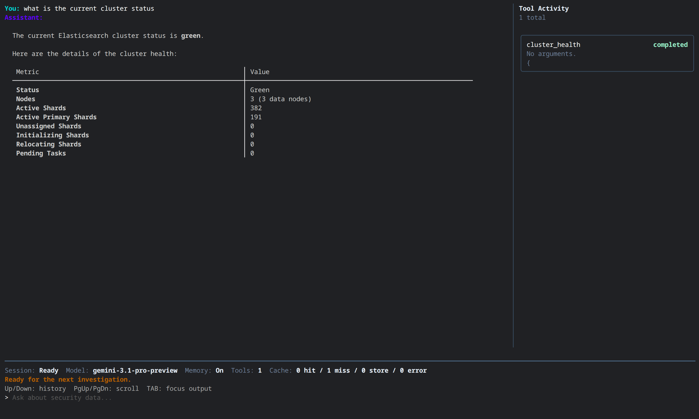
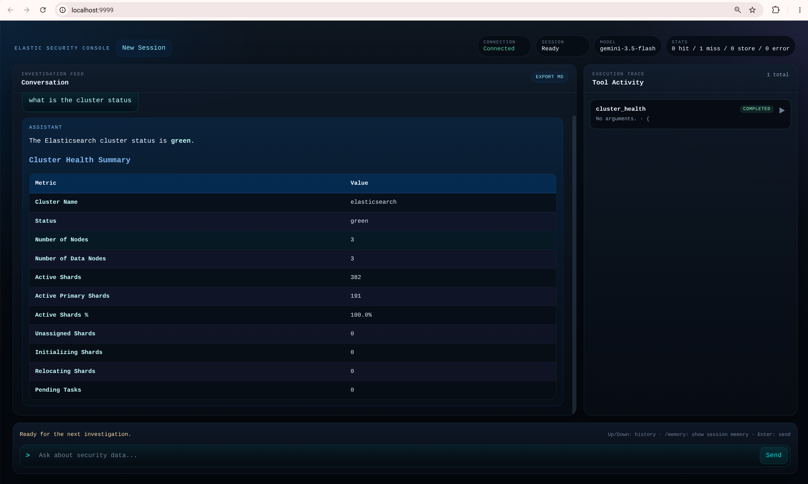

# Elastic Security MCP

This project implements the [Model Context Protocol (MCP)](https://modelcontextprotocol.io/) to provide a bridge between Large Language Models and Elasticsearch security data.

It consists of two main components:
1. **Elastic MCP Server**: A standalone server that exposes Elasticsearch tools via the MCP protocol.
2. **Elastic CLI**: A feature-rich client (TUI and Web UI) that uses the MCP server to provide an AI-powered security analyst experience.

For a detailed look at how these components interact, see [ARCHITECTURE.md](ARCHITECTURE.md).

## Key Features

- **Security-aware search tools**: Structured, snippets-first search across network (Zeek, Suricata, Packetbeat) and endpoint (process, alerts) data, plus raw Query DSL access for advanced cases.
- **Fast DNS lookups**: Redis-backed reverse lookups for domains and IPs from a rolling 24-hour window, alongside full historical search via Elasticsearch.
- **Bulk export**: Stream large result sets to size-rolled JSONL files with scroll pagination and progress notifications.
- **Kibana integration**: Optional tools for detection rules, Fleet agents, spaces, and arbitrary Kibana API access.
- **Agentic CLI**: A TUI and Web UI client with multi-provider LLM support (OpenAI, Anthropic, Gemini), conversation memory, and Markdown-rendered investigation reports.
- **Performance-conscious defaults**: Response caching, capped response sizes, and opt-in exact-count aggregation to keep large clusters responsive.


## Key Libraries

This project leverages several powerful libraries:

- [**Elasticsearch Go Client**](https://github.com/elastic/go-elasticsearch): The official Go client for Elasticsearch (v9).
- [**Model Context Protocol (MCP) SDK**](https://github.com/modelcontextprotocol/go-sdk): SDK for building MCP servers and clients.
- [**goai**](https://github.com/zendev-sh/goai): A Go library for integrating with multiple LLM providers (OpenAI, Anthropic, Gemini) with a unified interface and built-in agentic tool-calling loop support.
- [**Bubble Tea**](https://github.com/charmbracelet/bubbletea): A powerful TUI framework for Go.
- [**Lip Gloss**](https://github.com/charmbracelet/lipgloss): Style and layout primitives for the terminal.
- [**Cobra**](https://github.com/spf13/cobra): A library for creating powerful modern CLI applications.
- [**Glamour**](https://github.com/charmbracelet/glamour): Markdown rendering for the terminal.
- [**Redis Go Client**](https://github.com/redis/go-redis): Type-safe Redis client for Go.

see [PKG.md](PKG.md) for detailed list.

## MCP Server Tools

The MCP server provides the following tools to any compatible host:

### Elasticsearch Tools

- **list_indices**: List available Elasticsearch indices with doc counts, store size, and health. Supports optional pattern filtering (e.g. `logs-zeek.*`). Results are cached for up to 1 hour.
- **cluster_health**: Return Elasticsearch cluster health status (green/yellow/red), node counts, shard counts, and unassigned shards. Accepts an optional `level` parameter (`cluster`, `indices`, or `shards`) for more detail.
- **search_security_events**: Structured, snippets-first search for ECS-style network and endpoint event data (Zeek, Suricata, Packetbeat, Elastic Agent). Supports typed filters (`text`, `start`, `end`, `ip`, `src_ip`, `dst_ip`, `mac`, `domain`, `url`, `dataset`) with boosted network fields and highlighting. At least one filter is required.
- **search_security_stats**: Answer one bounded telemetry question without returning raw documents — top values (`aggregation_type: terms`), an event-rate timeline (`date_histogram`), or an approximate unique-value count (`cardinality`). Requires an explicit RFC3339 `start`/`end` window (max 31 days by default, configurable via `STATS_MAX_RANGE_HOURS`); date_histogram accepts calendar intervals (`1m`, `1h`, `1d`, `1w`, `1M`, `1q`, `1y`) or fixed intervals (e.g. `15m`, `6h`) and rejects requests whose estimated bucket count exceeds `STATS_MAX_BUCKETS` (default 250). `cardinality` results are always approximate. Exact total-hit counts are disabled by default; pass `include_total: true` for an exact count. For multiple/nested/raw aggregations, use `search_elastic` instead.
- **export_security_events**: Export large volumes of security events to JSONL files with automatic size-based file rolling, scroll-based pagination, and MCP progress notifications. Uses the same filters as `search_security_events`.
- **search_security_alerts**: Search Elastic Security detection alerts in `.alerts-security.alerts-*` indices, filtering by query, severity, rule name, host, and time range. Projects key process execution details.
- **search_processes**: Search endpoint process events (`logs-endpoint.events.process-*`) with flexible filtering by executable, command line, process/parent name, user, PID, SHA256 hash, host, and time range. Exact total counting is disabled by default for performance (`hits.total.relation` may be `gte`); pass `include_total: true` for an exact count.
- **lookup_domain**: Fast reverse lookup of DNS activity for a domain, from a rolling 24-hour Redis index of Zeek DNS logs. Returns recent queries, source IPs, and resolved addresses. For full historical queries, use `search_security_events`.
- **lookup_ip**: Fast reverse lookup of DNS activity (answers and queries) for an IP address, from a rolling 24-hour Redis index of Zeek DNS logs. For full historical queries, use `search_security_events`.
- **search_elastic**: Raw Elasticsearch Query DSL access for advanced or unsupported queries. Prefer `search_security_events` for common filters; use this only when raw DSL control is required. Aggregation-only (`size: 0`) queries default `track_total_hits` to `false` unless set explicitly; prefer exact term filters and avoid leading wildcards for best performance.

### Kibana Tools (optional — requires `KIBANA_URL`)

- **kibana_api_request**: Execute an arbitrary HTTP request (GET, POST, PUT, DELETE, PATCH) against any Kibana REST API endpoint.
- **list_kibana_spaces**: List all available spaces in a Kibana instance.
- **list_detection_rules**: Retrieve a paginated list of detection rules from the Elastic Security app.
- **get_detection_rule**: Get details of a specific detection rule by its internal `id` or user-defined `rule_id`.
- **list_agents**: Retrieve Elastic Agents from Fleet using the Kibana Fleet API, with optional KQL filtering and pagination.

## Screenshots

### TUI (Terminal User Interface)


The project includes a powerful, agentic CLI that acts as a security analyst assistant.

- **Interactive TUI**: Built with Bubble Tea and Lip Gloss for a modern terminal experience.
- **Multi-Provider Support**: Seamlessly switch between OpenAI, Anthropic, and Google Gemini models.
- **Interactive Model Selection**: Pick your preferred provider and model on startup if not pre-configured.
- **Conversation Memory**: Built-in context management for long-running investigations (type `/memory` to view).
- **One-Shot Execution**: Run quick queries and exit using the `--prompt` or `-p` flag.
- **Markdown Rendering**: High-quality rendering of tables and analysis results using Glamour.
- **Optional Web UI**: Use the `--webui` flag to start a local web server with a similar look and feel to the terminal experience.

### CLI Flags

| Flag | Short | Default | Description |
|------|-------|---------|-------------|
| `--model` | `-m` | `""` | Model ID to use (e.g. `gpt-5`, `claude-sonnet-4-6`). Falls back to `ELASTIC_MODEL` env var or interactive selection. |
| `--memory` | | `true` | Enable conversation memory across turns. |
| `--prompt` | `-p` | `""` | Run a single prompt non-interactively and exit. |
| `--webui` | | `false` | Start the optional browser-based Web UI instead of the TUI. |
| `--port` | | `8080` | Port for the Web UI server. |

### Web UI (Browser Interface)


If you prefer a browser-based interface that maintains the same "security terminal" aesthetic:

```bash
./elastic-cli --webui --port 8080
```

Open `http://localhost:8080` in your browser to start.

The Web UI provides a specialized workspace for security investigations:

- **Interactive Security Console**: A modern, responsive interface designed for deep-dive security analysis.
- **Dual-Panel Workspace**:
    - **Investigation Feed**: A real-time conversation stream with the AI analyst. Includes full Markdown support for high-quality reports, data tables, and formatted analysis.
    - **Execution Trace (Tool Activity)**: A dedicated sidebar that provides visibility into the agent's thought process. Monitor tool calls as they happen, with expandable cards showing input arguments and raw output results.
- **Real-time Feedback**: Powered by WebSockets to provide immediate updates on tool progress ("Analyzing request", "Running search_security_events", etc.) and streaming responses.
- **Command History**: Efficiently navigate previous queries using `Up/Down` arrow keys, with history persisted across browser sessions.
- **Session Management**: Quickly clear context and start fresh investigations with a single click.
- **Export to Markdown**: Save your entire investigation, including both your queries and the AI's analysis, as a formatted Markdown file for easy documentation or reporting.
- **Agentic Intelligence**: The same powerful security analyst from the CLI, tuned to prefer structured tools like `search_security_events` for accurate data retrieval.


## Prerequisites

- Go 1.26.2 or higher
- Access to an Elasticsearch cluster (URL and API Key)
- Redis server for caching and lookup tools:
  - Default: `localhost:6379`
  - Recommended: Run via Podman (see below)
- At least one LLM API key for the CLI:
  - `OPENAI_API_KEY`
  - `ANTHROPIC_API_KEY`
  - `GEMINI_API_KEY`

## Infrastructure Setup

To start the required Redis instance using Podman:

```bash
make redis-up
```

This uses `podman compose` to start an alpine-based Redis container with persistence enabled. You can monitor logs with `make redis-logs` or access the CLI with `make redis-shell`.

## Installation

```bash
make all
```

This will build both `elastic-mcp-server` and `elastic-cli`.

## Configuration

The server and CLI require the following environment variables:

- `ELASTIC_URL`: The full URL of your Elasticsearch cluster.
- `ELASTIC_KEY`: A valid API Key for authentication.

The CLI also requires one of the following, depending on the model you choose:

- `OPENAI_API_KEY`
- `ANTHROPIC_API_KEY`
- `GEMINI_API_KEY`

Optional variables:

- `KIBANA_URL`: The URL of your Kibana instance (e.g. `http://localhost:5601`). Required to enable the Kibana tools.
- `KIBANA_USER`: Optional. The username for Basic Auth (defaults to `elastic`).
- `KIBANA_PASS`: Optional. The password for Basic Auth.
- `KIBANA_KEY`: Optional. A Kibana API Key for authentication.
- `KIBANA_SPACE`: Optional. The Kibana Space ID (e.g. `default` or `marketing`) to query.
- `ELASTIC_MODEL`: Default CLI model ID if you do not pass `--model`.
- `ELASTIC_MCP_SERVER`: Path to the MCP server binary for the CLI and smoke-test client.
- `CLIENT_LOG_FILE`: Log file path for the CLI. Default is `elastic-cli.log`.
- `CLIENT_LOG_LEVEL`: `debug`, `info`, `warn`, or `error` for the CLI. Default is `info`.
- `CLIENT_LOG_PAYLOADS`: Set to `true` to log full CLI LLM request/response payloads. Default is off.
- `CLIENT_HISTORY_FILE`: Path to the CLI command history file. Default is `~/.elastic-cli-history`.
- `SERVER_LOG_FILE`: Log file path for the MCP server. Default is `elastic-mcp-server.log`.
- `SERVER_LOG_LEVEL`: `debug`, `info`, `warn`, or `error` for the MCP server. Default is `info`.
- `SERVER_LOCK_FILE`: Path to the server PID lock file. Default is `elastic-mcp-server.lock`.
- `CACHE_ENABLED`: Set to `false` to disable Redis caching. Default is `true`.
- `REDIS_ADDR`: Address of the Redis server. Default is `localhost:6379`.
- `CACHE_SEARCH_SECURITY_EVENTS_TTL`: Cache TTL in seconds for `search_security_events`. Default is `600`.
- `CACHE_SEARCH_ELASTIC_TTL`: Cache TTL in seconds for `search_elastic`. Default is `600`.
- `CACHE_SEARCH_SECURITY_STATS_TTL`: Cache TTL in seconds for `search_security_stats`. Default is `60` — short-lived, so cached telemetry isn't mistaken for live monitoring.
- `CACHE_LIST_INDICES_TTL`: Cache TTL in seconds for `list_indices`. Default is `3600`.
- `MAX_RESPONSE_CHARS`: Maximum JSON response size returned by search tools before truncation. Default is `20000`.
- `TOOL_TIMEOUT_SECS`: Per-tool execution timeout in seconds. Default is `30`.
- `EXPORT_TIMEOUT_SECS`: Overall timeout in seconds for the `export_security_events` tool. Default is `1800` (30 minutes).
- `EXPORT_BATCH_TIMEOUT_SECS`: Per-scroll-batch timeout in seconds during exports. Default is `180`.
- `STATS_MAX_RANGE_HOURS`: Maximum `start`/`end` span accepted by `search_security_stats`, in hours. Default is `744` (31 days).
- `STATS_MAX_BUCKETS`: Maximum estimated `date_histogram` bucket count accepted by `search_security_stats`. Default is `250`.

## Usage

### Running the CLI (Recommended)

The CLI provides an agentic experience to interact with your security data.

```bash
export ELASTIC_URL="your_url"
export ELASTIC_KEY="your_api_key"
export OPENAI_API_KEY="your_openai_key"
./elastic-cli
```

You can also pick a model explicitly:

```bash
./elastic-cli --model gpt-5
```

Run a single query non-interactively and exit:

```bash
./elastic-cli --prompt "Show me the top 10 DNS queries in the last hour"
```

The CLI is tuned to prefer `search_security_events` for typical investigations and only fall back to `search_elastic` when raw DSL control is required.

### Running the server standalone

The server communicates over Standard Input/Output (stdio) and can be used with any MCP host. It enforces a single-instance lock (via `elastic-mcp-server.lock`) to prevent duplicate server processes.

```bash
./elastic-mcp-server
```

### Integrating with external MCP Clients (Claude Code, Gemini CLI)

A template configuration is available in `.mcp.json`. You can copy or reference this file to configure external MCP hosts (like Claude Desktop or Cursor).

For example, to configure the server in **Claude Desktop**, edit `~/.config/Claude/claude_desktop_config.json` (macOS) or `%APPDATA%\Claude\claude_desktop_config.json` (Windows) and include the server definition from `.mcp.json`:

```json
{
  "mcpServers": {
    "elastic-security-mcp": {
      "command": "elastic-mcp-server",
      "args": [],
      "env": {
        "SERVER_LOG_LEVEL": "debug",
        "ELASTIC_URL": "${ELASTIC_URL}",
        "ELASTIC_KEY": "${ELASTIC_KEY}",
        "KIBANA_URL":  "${KIBANA_URL}",
        "KIBANA_USER": "mcp",
        "KIBANA_PASS": "${KIBANA_PASS}"      }
    }
  }
}
```

OpenCode

```
{
  "$schema": "https://opencode.ai/config.json",
  "mcp": {
    "elastic-security-mcp": {
      "type": "local",
      "command": [
        "elastic-mcp-server"
      ],
      "environment": {
        "SERVER_LOG_LEVEL": "debug",
        "ELASTIC_URL": "{env:ELASTIC_URL}",
        "ELASTIC_KEY": "{env:ELASTIC_KEY}",
        "KIBANA_URL": "{env:KIBANA_URL}",
        "KIBANA_USER": "mcp",
        "KIBANA_PASS": "{env:KIBANA_PASS}"
      }
    }
  }
}
```

Codex (in `repo/.codex/config.toml`)

```
[mcp_servers.elastic-security-mcp]
command = "/home/mdfranz/github/elastic-security-mcp/elastic-mcp-server"
args = []

env_vars = [
  "ELASTIC_URL",
  "ELASTIC_KEY",
  "KIBANA_URL",
  "KIBANA_PASS",
]

[mcp_servers.elastic-security-mcp.env]
# Static values can remain here.
SERVER_LOG_LEVEL = "debug"
KIBANA_USER = "mcp"
```

### Python Test Client (pydantic-ai)

A standalone Python test client is available in `tools/pydantic_ai_test_mcp.py`. It launches `elastic-mcp-server` as an MCP subprocess via [pydantic-ai](https://ai.pydantic.dev/), then runs it through three fixed investigation tasks (cluster/index discovery, IP enrichment, and alert-to-process pivoting) while tracking token usage per task.

It's managed with [`uv`](https://docs.astral.sh/uv/) and has no dependency on the Go toolchain beyond the built `elastic-mcp-server` binary.

```bash
make build   # produces ./elastic-mcp-server, which the test client launches

export ELASTIC_URL="your_url"
export ELASTIC_KEY="your_api_key"
export KIBANA_URL="your_kibana_url"       # optional, enables Kibana tool tasks
export ANTHROPIC_API_KEY="your_key"       # or OPENAI_API_KEY / GOOGLE_API_KEY

uv run tools/pydantic_ai_test_mcp.py
```

Pass a model ID as the first argument to use a different provider or model (defaults to `claude-haiku-4-5`):

```bash
uv run tools/pydantic_ai_test_mcp.py gemini-2.5-flash
uv run tools/pydantic_ai_test_mcp.py gpt-5
```

Logs (including per-task token totals) are written to `pydantic_ai_test.log` and echoed to the console.

## Troubleshooting

The CLI and Server log to files for debugging:
- `elastic-cli.log`: Contains CLI-side LLM interaction details and tool call logs (overridden by `CLIENT_LOG_FILE`).
- `elastic-mcp-server.log`: Contains MCP server-side logs and Elasticsearch interaction details (overridden by `SERVER_LOG_FILE`).

You can change the log file locations independently with `CLIENT_LOG_FILE` and `SERVER_LOG_FILE`.
Set `CLIENT_LOG_LEVEL=debug` or `SERVER_LOG_LEVEL=debug` for more detail in the corresponding process.
Set `CLIENT_LOG_PAYLOADS=true` only when you explicitly want full CLI request/response payload logging.

If the server fails to start with a "already running" error, check or remove the lock file (default: `elastic-mcp-server.lock`).

The server validates `ELASTIC_URL` and `KIBANA_URL` at startup and will exit immediately with a descriptive error if either is missing an `http`/`https` scheme or host, or still contains an unresolved `${...}` placeholder (a common symptom of misconfigured MCP host env templating, e.g. in `.mcp.json`).
