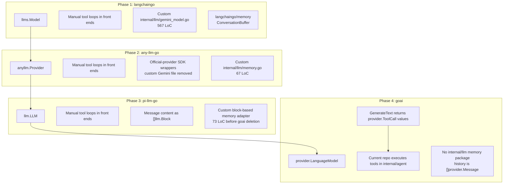

# LLM Provider Migration and Integration History

This document tracks how the LLM orchestration layer in `elastic-security-mcp`
changed across the `langchaingo`, `any-llm-go`, `pi-llm-go`, and `goai`
implementations. It intentionally separates confirmed repo evidence from
library capabilities so the comparison does not overstate what the current code
uses.

The strongest measured outcome was not a universal dependency reduction. The
clearest outcome was code-shape simplification: provider-specific Gemini HTTP
code was removed, tool-call/message representations became more direct, and the
CLI and Web UI eventually moved behind one shared `internal/agent` loop.

---

## Orchestration Evolution



---

## Provider Feature Comparison

| Aspect | Phase 1: `langchaingo` | Phase 2: `any-llm-go` | Phase 3: `pi-llm-go` | Phase 4: `goai` (current) |
| :--- | :--- | :--- | :--- | :--- |
| Model interface | `llms.Model` | `anyllm.Provider` | `llm.LLM` | `provider.LanguageModel` |
| Generation call | `GenerateContent(...)` | `Completion(ctx, CompletionParams{...})` | `Complete(ctx, LLM, Request{...})` | `GenerateText(ctx, model, opts...)` |
| Message structure | `llms.MessageContent` | `anyllm.Message` with mostly flat string content | `llm.Message` with `[]llm.Block` | `provider.Message` with `[]provider.Part` |
| System prompt | System role in history | System role in history | `llm.Request.System` | `goai.WithSystem(...)` |
| Tool definition | `llms.Tool` / `llms.ToolCall` | `anyllm.Tool` / `anyllm.ToolCall` | `llm.Tool` / `llm.ToolCallBlock` | `goai.Tool` / `provider.ToolCall` |
| Tool execution in this repo | Manual front-end loop | Manual front-end loop | Manual front-end loop | Manual shared loop in `internal/agent` |
| Automatic tool-loop capability | Not used | Not used | Not used | Available in `goai` only when tools have `Execute` handlers and `MaxSteps > 1`; current repo does not use that path |
| Gemini thought-signature handling | App-level support via custom Gemini client, not library-level support | Library-level support by delegating Gemini details to Google GenAI SDK wrapper | Not verified in repo history; branch notes mention future `ThinkingBlock` visibility, but no `thoughtSignature` preservation evidence was found | Library-level support: Google provider preserves `thoughtSignature` in metadata/provider parts; current app does not render reasoning traces |
| Memory package | `langchaingo/memory.ConversationBuffer` | Custom `internal/llm/memory.go` | Custom block-based `internal/llm/memory.go` | Deleted; front ends retain `[]provider.Message` history and render `/memory` from that slice |

---

## Corrections to Earlier Claims

| Earlier wording | Problem | More accurate statement |
| :--- | :--- | :--- |
| `goai` made tool execution "automated internally" in the current app. | `goai` supports this, but the current repo builds schema-only `goai.Tool` values and executes `provider.ToolCall`s in `internal/agent.Engine.callTool`. | Current `goai` usage standardizes provider messages and tool-call shapes, while `internal/agent` owns execution, event emission, cache-marker normalization, and MCP calls. |
| `goaimcp.ConvertTools` deleted all dispatcher logic. | The branch plan recommended `ConvertTools`, but the merged code manually constructs `goai.Tool{Name, Description, InputSchema}` and calls `MCPClient.CallTool` itself. | The dispatcher moved out of the front ends and into `internal/agent`; it was not fully replaced by executable `goai.Tool` closures. |
| Migration reduced dependency weight and binary size. | The repo has no measured binary-size or build-time data in this document. `go.mod` require-line counts went from 62 before `any-llm-go`, to 87 after `any-llm-go`, then back to about 60 after `pi-llm-go`/`goai`. | Treat dependency impact as mixed: `any-llm-go` removed custom app code but added official provider SDK transitive dependencies; `pi-llm-go` and `goai` returned the manifest closer to the earlier size. |
| `langchaingo` was the sole reason custom Gemini thought-signature code existed. | The local evidence proves the custom file existed and was deleted in the `any-llm-go` migration, but it does not prove that `langchaingo` could not have supported the feature by another path. | The migration removed a repo-local 567-line Gemini wrapper by delegating provider-specific response handling to a provider library. |
| All block-based libraries preserved Gemini thought signatures. | `pi-llm-go` improved content shape, but local branch history contains no `thoughtSignature` handling. Its port notes list reasoning trace visibility as an opportunity, not landed behavior. | Among the evaluated replacement libraries, `any-llm-go` and `goai` are the supported choices for Gemini thought-signature preservation. The original `langchaingo` phase supported it only through custom app code. |
| `goai` is "zero-overhead". | The current implementation still has orchestration code: `internal/agent/agent.go` was added with 367 LoC in `c7ab787`. | The final shape centralizes orchestration rather than eliminating it. |

---

## Evidence From Repo History

| Commit / branch | Evidence |
| :--- | :--- |
| `a59d51e` (`origin/any-llm-go`) | Removed `internal/llm/gemini_model.go` (567 LoC), added `internal/llm/memory.go` (67 LoC), changed `cmd/cli/main.go` by +178/-214 lines, and changed `internal/webui/server.go` by +51/-72 lines. The resulting `go.mod` included `google.golang.org/genai`, matching the migration goal of delegating Gemini-specific response handling. |
| `6078c18` (`origin/pi-llm-port`) | Partial/evaluation port. Replaced `anyllm.ChatCompletion`/`ToolCall` usage with `llm.Message`/`ToolCallBlock`, updated memory to block content, removed 73 lines from `go.sum`, and changed `go.mod` by +3/-33 lines. The branch was not finished once provider-feature support made `any-llm-go` and `goai` the stronger candidates. No branch hit for `thoughtSignature` was found; the port notes treated reasoning trace visibility as a future opportunity. |
| `a712d25` (`origin/zendev-goai`) | Deleted `internal/llm/memory.go` (73 LoC), replaced `pi-llm-go` with `github.com/zendev-sh/goai v0.8.5`, and initially planned to collapse tool loops into `GenerateText`. |
| `c7ab787` (`origin/goai-final-merge`) | Added `internal/agent/agent.go` (367 LoC), removed 370 lines from `cmd/cli/main.go`, removed 212 lines from `internal/webui/server.go`, and made the shared agent loop the current source of truth. |
| Current `main` | `cmd/cli/main.go` constructs tools with `Name`, `Description`, and `InputSchema` only. `internal/agent.Engine.Turn` calls `goai.GenerateText`, reads `result.ToolCalls`, executes each call with `MCPClient.CallTool`, appends `goai.ToolMessage`, and loops. |

Manifest-size proxy from `go.mod`/`go.sum` history:

| Revision | `go.mod` require lines | `go.sum` lines | Interpretation |
| :--- | ---: | ---: | :--- |
| Before `a59d51e` (`langchaingo`) | 62 | 178 | Baseline with `langchaingo` plus custom Gemini wrapper. |
| `a59d51e` (`any-llm-go`) | 87 | 239 | Official provider SDKs increased manifest size while removing app-owned Gemini code. |
| `6078c18` (`pi-llm-go`) | 60 | 166 | Manifest became smaller after moving away from SDK-heavy wrapper dependencies. |
| `a712d25` (`goai`) | 60 | 170 | Similar manifest size to `pi-llm-go` at initial port. |
| Current `main` | 62 | 174 | Similar to the post-`pi-llm-go`/`goai` range, with later project dependencies added. |

These counts are a lightweight proxy, not proof of binary size, compile time, or
security exposure. Any claim about those outcomes should be backed by measured
binary artifacts, `go test -json`/build timings, or a dependency scanner report.

---

## Implementation Details

### 1. `langchaingo`: broad framework plus custom Gemini code

The initial integration used `github.com/tmc/langchaingo`. Its public API
centers on `llms.Model`, whose primary chat-style method is
`GenerateContent(ctx, messages, options...)`. It also provides
`memory.ConversationBuffer`, described by its docs as a simple memory that
stores previous conversational turns.

The local tradeoff was not just framework size. The bigger app-owned cost was
`internal/llm/gemini_model.go`, a 567-line custom Gemini client used to preserve
Gemini-specific response details such as thought signatures. Google’s current
Go GenAI SDK models those fields directly on `genai.Part` as `Thought` and
`ThoughtSignature`, which explains why later provider-specific SDK wrappers were
attractive.

### Gemini thought-signature support

Among the evaluated replacement libraries, the repo evidence points to
`any-llm-go` and `goai` as the two library-level options that addressed Gemini
thought signatures:

| Implementation | Support level | Evidence |
| :--- | :--- | :--- |
| `langchaingo` phase | App-level workaround | `internal/llm/gemini_model.go` stored and reattached `thoughtSignature` values manually; this was custom repo code, not a generic `langchaingo` feature. |
| `any-llm-go` phase | Library/provider-wrapper support | The migration deleted the custom Gemini file, moved provider handling behind `any-llm-go`, and pulled in `google.golang.org/genai`; the library docs advertise Gemini reasoning support and official-provider SDK delegation. |
| `pi-llm-go` phase | Partial/evaluation port; not selected | The branch was not finished after provider-feature support made `any-llm-go` and `goai` the stronger choices. It has no `thoughtSignature` hits. Its notes mention extracting `llm.ThinkingBlock` parts as a future UI opportunity, which is weaker than preserving Gemini signatures across tool turns. |
| `goai` phase | Library/provider-wrapper support | `goai` v0.8.5's Google provider preserves `thoughtSignature` in provider metadata and has tests for streaming reasoning, tool calls with thought signatures, and message conversion with signatures. |

### 2. `any-llm-go`: SDK delegation, but not fewer dependencies

The `any-llm-go` migration deleted the custom Gemini file and replaced
`langchaingo/memory` with a small repo-local buffer. The provider API exposed
`Provider.Completion(ctx, CompletionParams{...})`, `Message`, `Tool`, and
`ToolCall` types that fit the existing manual loop with limited conceptual
change.

The dependency story is mixed. The library advertises a unified interface and
official SDK usage, including `openai-go` and `anthropic-sdk-go`; this matched
the goal of delegating provider-specific behavior. However, the local manifest
expanded at that commit. The benefit was primarily deleting app-owned provider
code, not proving lower dependency weight.

### 3. `pi-llm-go`: block-based messages and smaller manifest

The `pi-llm-go` migration changed the shape of the app more than the high-level
control flow. It moved message content to `[]llm.Block`, represented tool calls
as `llm.ToolCallBlock`, represented tool results as `llm.ToolResultBlock`, and
moved the system prompt out of history into `llm.Request.System`.

The app still executed tools manually in the front ends. This phase mainly made
the data model closer to provider-native multipart content and reduced the
manifest compared with the `any-llm-go` phase. It should not be credited with
Gemini thought-signature support without more evidence; the branch history shows
generic thinking-block ambitions, not explicit signature preservation.

### 4. `goai`: standardized provider parts plus a shared local loop

`goai` provides a `provider.LanguageModel` interface, functional options such as
`WithMessages`, `WithSystem`, and `WithTools`, and a `TextResult` containing
`Text`, `ToolCalls`, `Steps`, and `ResponseMessages`. Its docs state that
`GenerateText` can automatically run a tool loop when executable tools are
provided and `MaxSteps > 1`.

The current `elastic-security-mcp` implementation deliberately does something
slightly different:

1. It calls `goai.GenerateText` for one generation step.
2. It appends `result.ResponseMessages` to conversation history.
3. It inspects `result.ToolCalls`.
4. It executes each tool through `goaimcp.Client.CallTool`.
5. It normalizes cache markers such as `✓ ` and `↓ ` for UI display.
6. It appends `goai.ToolMessage(...)` and loops until the model returns final text.

That shared loop lives in `internal/agent` and is now used by the TUI, Web UI,
and one-shot CLI path. This is still a real simplification because it removed
duplicated loop implementations from the front ends, but it is not the same as
outsourcing tool execution entirely to `goai`.

---

## Code Pattern Comparison

### Previous front-end-local loop

```go
for {
    resp, err := llm.Complete(ctx, client, request)
    toolCalls := messageToolCalls(resp)
    if len(toolCalls) == 0 {
        break
    }
    for _, tc := range toolCalls {
        res, err := mcpSession.CallTool(ctx, tc.Name, tc.Arguments)
        // Format and append tool result blocks to history.
    }
}
```

### Current shared loop shape

```go
for {
    result, err := goai.GenerateText(ctx, engine.Model,
        goai.WithMessages(history...),
        goai.WithSystem(agent.SystemPrompt),
        goai.WithTools(engine.Tools...),
        goai.WithTemperature(0),
        goai.WithMaxOutputTokens(4096),
    )
    history = append(history, result.ResponseMessages...)

    if len(result.ToolCalls) == 0 {
        return result.Text
    }
    for _, tc := range result.ToolCalls {
        toolResp, err := engine.MCPClient.CallTool(ctx, tc.Name, args)
        history = append(history, goai.ToolMessage(tc.ID, tc.Name, text))
    }
}
```

### `goai` automatic-loop capability not currently used

```go
tool := goai.Tool{
    Name:        "search_security_events",
    Description: "...",
    InputSchema: schema,
    Execute: func(ctx context.Context, input json.RawMessage) (string, error) {
        return callMCPTool(ctx, input)
    },
}

result, err := goai.GenerateText(ctx, model,
    goai.WithMessages(history...),
    goai.WithTools(tool),
    goai.WithMaxSteps(10),
)
```

This pattern is a possible future simplification, but adopting it would need to
preserve current UI event emission, cache-hit/cache-store flags, error handling,
stall detection, and MCP shutdown behavior.

---

## Lessons Learned for Go LLM Integration

1. **Measure dependency claims.** Local history supports code deletion and
   manifest changes; it does not prove smaller binaries, faster builds, or lower
   risk without separate measurements.
2. **Prefer provider-native data shapes for provider-specific features.**
   Gemini thought signatures are first-class fields in the Google GenAI SDK, so
   wrappers that preserve provider parts reduce the need for custom JSON parsing.
3. **Centralize orchestration before automating it away.** Moving the loop into
   `internal/agent` eliminated front-end drift while keeping visibility into
   tool lifecycle events.
4. **Executable tool definitions are still attractive.** `goai.Tool.Execute`
   plus `WithMaxSteps` could remove more loop code later, but only if the app can
   retain its current observability and UI semantics.

---

## References

- `goai` package docs: `GenerateText` automatically runs a tool loop only when
  tools include `Execute` functions and `MaxSteps > 1`: <https://pkg.go.dev/github.com/zendev-sh/goai#GenerateText>
- `goai` README feature list: auto tool loop, MCP support, provider list, and
  dependency claims from the library itself: <https://github.com/zendev-sh/goai>
- `goai.Tool` source docs in the module cache: `Tool` includes `Execute`, but
  the current repo leaves it nil for MCP tools.
- Google GenAI Go SDK: `genai.Part` includes `Thought` and
  `ThoughtSignature`: <https://pkg.go.dev/google.golang.org/genai#Part>
- `langchaingo` `llms.Model` API: <https://pkg.go.dev/github.com/tmc/langchaingo/llms#Model>
- `langchaingo` `memory.ConversationBuffer` API:
  <https://pkg.go.dev/github.com/tmc/langchaingo/memory#ConversationBuffer>
- `any-llm-go` docs: unified provider API, tools, reasoning, and official SDK
  wrapper claims: <https://pkg.go.dev/github.com/mozilla-ai/any-llm-go>
- Local branch evidence: `origin/any-llm-go`, `origin/pi-llm-port`,
  `origin/zendev-goai`, and `origin/goai-final-merge`.
