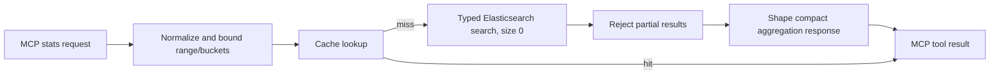

# Implementation Plan — Security Statistics Telemetry Tool

## Desired outcome

Add an MCP tool, `search_security_stats`, that lets an analyst or the LLM answer bounded telemetry questions—top values, event-rate timelines, and approximate unique-value counts—without returning raw documents.

The tool must be safe to call against large security indices: it must bound the time range and histogram buckets before querying Elasticsearch, avoid exact total-hit work unless explicitly requested, return a stable compact response, and make cached/freshness and partial-result behavior visible.

Examples of supported questions:

- “What are the top source IPs in Zeek logs from 09:00–12:00 UTC?”
- “Show the hourly event rate for Suricata alerts during this incident.”
- “Approximately how many unique DNS names were queried in the last day?”

This is intentionally a single-aggregation convenience tool. Requests requiring multiple aggregations, nested aggregations, arbitrary filters aggregations, or other raw Elasticsearch features remain the responsibility of `search_elastic`.

Retention on these indices is expected to be around 30 days, so the dominant use case is short, high-resolution windows — 15 minutes, 1 hour, 4/8 hours, up to 24 hours — not month/quarter/year rollups. Defaults, examples, and test emphasis throughout this plan should favor that range. Calendar intervals of `1M`/`1q`/`1y` are supported for completeness (a caller might still request a 30-day-wide `1d` histogram) but are edge cases, not the primary design target, and shouldn't drive default sizing.

## Public tool contract

### Input

Create `SecurityStatsArgs` in `internal/elasticsearch/security_stats.go`:

```go
type SecurityStatsArgs struct {
	Index              string `json:"index" jsonschema:"Index pattern to analyze, for example logs-zeek.*-* or logs-suricata.*-*"`
	Query              string `json:"query,omitempty" jsonschema:"Optional Elasticsearch query_string filter to apply within the required time range"`
	Field              string `json:"field,omitempty" jsonschema:"Field to aggregate. Required for terms and cardinality; use an aggregatable keyword/IP/numeric field (for example event.dataset, source.ip, or dns.question.name.keyword). Optional for date_histogram, which defaults to @timestamp."`
	AggregationType    string `json:"aggregation_type" jsonschema:"Aggregation type: terms, date_histogram, or cardinality"`
	Interval           string `json:"interval,omitempty" jsonschema:"date_histogram only: calendar 1m, 1h, 1d, 1w, 1M, 1q, or 1y; or a fixed interval such as 15m or 6h. Defaults to 1h."`
	Start              string `json:"start" jsonschema:"RFC3339 inclusive lower bound for @timestamp"`
	End                string `json:"end" jsonschema:"RFC3339 inclusive upper bound for @timestamp"`
	Size               int    `json:"size,omitempty" jsonschema:"terms only: maximum buckets to return; default 10, maximum 100"`
	IncludeTotal       bool   `json:"include_total,omitempty" jsonschema:"Request an exact matching-document count. Defaults to false because exact totals can be expensive on large ranges."`
	PrecisionThreshold int    `json:"precision_threshold,omitempty" jsonschema:"cardinality only: optional Elasticsearch precision threshold from 1 to 40000; higher values use more memory and improve accuracy."`
}
```

`index`, `aggregation_type`, `start`, and `end` are required. Requiring an explicit, valid time window prevents accidental all-history scans and gives histogram bucket limits a deterministic bound. `start` and `end` accept RFC3339 only; `end` must not precede `start`.

Normalization must trim string inputs, lowercase only `aggregation_type`, preserve interval case (so `1M` remains month), default `interval` to `1h`, and default/cap `size` to 10/100. It must reject:

- a blank index, unsupported aggregation type, or an empty required field;
- invalid/reversed timestamps or a range over the configured maximum (default 31 days);
- unsupported/invalid intervals;
- a date-histogram request whose estimated bucket count exceeds the configured maximum (default 250); and
- a cardinality precision threshold outside 1–40,000.

The implementation should expose the range and bucket limits through narrowly scoped configuration helpers (for example `STATS_MAX_RANGE_HOURS` and `STATS_MAX_BUCKETS`) with the defaults above. Do not silently coarsen an interval or truncate a time series: return an actionable error that asks for a shorter time range or coarser interval.

### Aggregation semantics

- `terms` uses `field` and the capped `size`. It returns the top buckets and Elasticsearch’s `sum_other_doc_count`/`doc_count_error_upper_bound` where applicable. It does not include documents missing the field.
- `date_histogram` uses `field` or `@timestamp`. Support calendar intervals exactly as `1m`, `1h`, `1d`, `1w`, `1M`, `1q`, and `1y`; all other accepted values must be validated fixed intervals. Preserve upper-case `M` before classification. Use `calendar_interval` for the named calendar forms and `fixed_interval` for fixed forms.

  Implementation note: `typedapi/types/enums/calendarinterval.CalendarInterval` only exposes named-word constants (`Hour`, `Month`, `Quarter`, ...), not the `1h`/`1M`/`1q` shorthand. Do not translate into those constants. The struct is just `{Name string}` with `MarshalText` emitting `Name` verbatim, so construct it directly as `calendarinterval.CalendarInterval{Name: "1M"}` (etc.) — Elasticsearch’s `calendar_interval` parser accepts the single-multiple shorthand directly on the wire. `fixed_interval` is typed as `types.Duration` (`any` underneath), so a plain Go string (`"15m"`, `"6h"`) can be assigned as-is.

- `cardinality` uses `field` and optionally `precision_threshold`. Label the result as approximate, including when Elasticsearch happens to return the exact value for a small set.

Bucket-count estimation for the pre-flight `STATS_MAX_BUCKETS` check is inherently approximate for calendar intervals, since month/quarter/year have variable lengths. Estimate using a fixed upper-bound day count per unit (e.g. 31 days/month, 92 days/quarter, 366 days/year) so the estimate is conservative (never undercounts) rather than exact.

Fields must be aggregatable in the selected indices. The tool should return Elasticsearch’s fielddata/mapping error without masking it; the schema and LLM guidance should steer callers to keyword fields such as `dns.question.name.keyword` when the base field is analyzed text.

### Response

Do not marshal the typed API’s `types.Aggregate` directly. Add a response-shaping function which returns a stable, aggregation-specific payload. This prevents a client from depending on the typed client’s internal Go representation and keeps output compact.

```json
{
  "aggregation_type": "terms",
  "index": "logs-zeek.*-*",
  "time_range": {"start": "…", "end": "…"},
  "took_ms": 12,
  "total_events": {"value": 10000, "relation": "gte", "exact": false},
  "stats": {
    "field": "source.ip",
    "buckets": [{"key": "10.0.0.5", "doc_count": 42}],
    "sum_other_doc_count": 11,
    "doc_count_error_upper_bound": 0
  }
}
```

For `date_histogram`, `stats` contains the effective `field`, `interval`, and ordered `{key, key_as_string, doc_count}` buckets. For `cardinality`, it contains `field`, `value`, `approximate: true`, and the effective precision threshold if supplied.

Set `TrackTotalHits` from `IncludeTotal`; its default must be false. Preserve Elasticsearch’s total-hit `relation` and derive `exact` from it rather than presenting a lower bound as an exact count.

If Elasticsearch reports a timed-out search or failed shards, return an error rather than presenting potentially incomplete telemetry as a successful result. Include enough context in the error for the analyst to narrow the request or check cluster health.

Before returning a terms response, enforce `MAX_RESPONSE_CHARS` by reducing the returned bucket list and setting an explicit truncation marker/count. Histogram requests are rejected before execution when the bucket bound would be exceeded; do not silently discard timeline buckets. If a single otherwise-valid shaped payload cannot fit the response limit, return an actionable error rather than emitting invalid or ambiguous partial JSON.

`internal/IMPL.md` already flags two near-duplicate "shrink an array proportionally to fit `MaxResponseChars()`" implementations (`truncateResults`/`truncateSlice` in `tools.go`, `truncateSecuritySearchResults` in `security_search.go`).

Implementation note: the generic `truncateSlice[T any]` helper sizes the array against the *whole* char budget with no margin — correct only when the array essentially *is* the whole payload (e.g. `list_indices`), not here, where the bucket list sits inside an envelope (`time_range`, `total_events`, ...) plus metadata this function itself adds afterward (`truncated`/`note`). Sizing the bare bucket array alone against the full budget leaves no room for that overhead and makes the "cannot fit" error trigger spuriously on nearly every large response. Mirror `truncateSecuritySearchResults` instead — marshal the whole envelope up front, apply a 10% margin — making this a third near-duplicate of that pattern rather than a `truncateSlice` reuse; update the `IMPL.md` cross-cutting-patterns note accordingly.

## Implementation path

### 1. Elasticsearch integration

Create `internal/elasticsearch/security_stats.go` with the following separation of responsibilities:

1. `normalizeSecurityStatsArgs` trims, defaults, parses/validates RFC3339 timestamps, validates the aggregation-specific fields, parses interval case-sensitively, and applies the time-range/bucket limits.
2. `buildSecurityStatsRequest` creates a `typedsearch.Request` with `Size = 0`, an `@timestamp` range filter, optional `query_string` filter, one named `stats` aggregation, and `TrackTotalHits = args.IncludeTotal`.
3. `runSecurityStatsSearch` applies `ensureSearchTimeout`, logs safe request metadata (never the free-text query), calls `es.Typed.Search()`, rejects timed-out/partial results, and passes the typed response to the shaper.
4. `shapeSecurityStatsResponse` type-switches the typed `stats` aggregation into the documented response contract. It must handle the typed variants Elasticsearch can return for terms (string, long, double, and unmapped), date histogram, and cardinality.
5. `RegisterSecurityStatsTool` normalizes before `WrapWithCache`, marshals the shaped response, and uses `recoverToolPanic` like the other Elasticsearch tools.

Use the official `go-elasticsearch/v9` TypedClient throughout. `typed_keys` defaults to `true` on Elasticsearch's `_search` endpoint itself (it is not something the Go client sets); the typed response decoder relies on that prefix (e.g. `sterms#stats`) to know which concrete `Aggregate` variant to instantiate before storing it under the decoded map key `stats` — without a `type#name` prefix on the wire it falls back to a bare-key path that cannot select the right variant. Call `.TypedKeys(true)` explicitly on the search request builder anyway rather than relying on the implicit server default, so behavior doesn't silently break if that default ever changes or a proxy in front of Elasticsearch drops the parameter. Tests and response shaping must expect aggregation names such as `sterms#stats` on the wire while reading the decoded map key `stats`.

### 2. Cache and tool registration

Add `SearchSecurityStatsTTL()` to `internal/elasticsearch/cache.go`, backed by `CACHE_SEARCH_SECURITY_STATS_TTL` with a 60-second default. This makes short-lived telemetry cacheable without presenting ten-minute-old data as live monitoring. Preserve the existing `WrapWithCache` metadata/prefix behavior so clients expose cache status.

Register the new tool in `RegisterTools` before `search_security_events` using the single shared `ToolCache`:

```go
RegisterSecurityStatsTool(server, es, cache)
RegisterSecuritySearchTool(server, es, cache)
```

### 3. Agent and documentation guidance

Update `internal/agent/agent.go` to say:

- prefer `search_security_stats` for one bounded terms distribution, date histogram, or cardinality question;
- provide an explicit RFC3339 start/end window and use a coarser interval if the requested timeline is too granular;
- use aggregatable fields and `.keyword` for analyzed text; and
- use `search_elastic` only when the request needs unsupported/raw/multiple/nested aggregations.

This change must replace the ambiguity in the current raw-aggregation guidance, not merely add a generic tool name.

Update `README.md` with the new tool, its bounded-time requirement, supported aggregation types, approximate cardinality, and the new cache configuration. Update `internal/IMPL.md` with a `security_stats.go` entry and a Mermaid flow diagram covering validation, cache lookup, typed search, response shaping, and MCP output.



## Verification plan

### Unit tests

Add `internal/elasticsearch/security_stats_test.go` covering:

- normalization of whitespace/defaults/caps, plus blank index, unsupported aggregation, missing field, invalid timestamps, reversed/oversized ranges, invalid intervals, invalid precision thresholds, and bucket-limit rejection;
- fixed intervals across the primary target ranges — `15m`, `1h`, `4h`, `8h`, and `24h` windows/buckets — since these are the intervals a ~30-day-retention deployment will actually see in practice; calendar forms (`1h`, `1M`, `15m` selection correctness, preservation of `1M` as a calendar month) still need coverage but as a secondary/edge case, not the primary test emphasis;
- serialized request JSON for each aggregation, including `size: 0`, timestamp/query filters, terms size, cardinality precision threshold, and default versus opt-in exact `track_total_hits`;
- shaping terms, date-histogram, cardinality, and unmapped-terms typed responses into the documented stable contract;
- terms response-size truncation and the “cannot safely fit” error path; and
- timed-out/failed-shard responses being rejected.

### Typed-client transport tests

Reuse the existing fake `http.RoundTripper` pattern from `security_search_test.go`. Execute `runSecurityStatsSearch` against mock Elasticsearch responses containing `sterms#stats`, `date_histogram#stats`, and `cardinality#stats`. Assert the request path, the automatic `typed_keys=true` query parameter, request body, and final shaped result. This verifies the part that builder-only tests cannot: decoding Elasticsearch’s typed aggregation response.

### Tool and manual verification

Add a registration/schema test that confirms `search_security_stats` is exposed with the required arguments. Then, with credentials available, invoke the tool through `test-mcp` against a small, bounded real index for each aggregation type. Confirm cache metadata on a repeated call, a `1M` histogram, approximate-cardinality labeling, and rejection of an over-granular histogram.

After implementation, run the relevant package tests and the project’s normal test suite; build/manual commands belong to implementation verification, not this plan review.

## Post-implementation refinements (from live-cluster log review)

Reviewing real server/CLI logs from manual testing against a live cluster surfaced two gaps not caught by unit tests, both since fixed:

- **Missing DEBUG request logging**: `search_elastic` and `search_security_events` both log their built request JSON at DEBUG level; `search_security_stats` didn't. This blocked diagnosing a real observed outlier (a `terms` query on `network.transport` taking 2016ms vs. 0-95ms for structurally identical calls moments before/after) since there was no way to inspect the actual request that ran. Fixed by adding the same `slog.Debug("search_security_stats query", ...)` line `runSecurityStatsSearch` uses elsewhere in the package.
- **Unmapped field indistinguishable from a genuinely empty result**: a `terms` aggregation on a field that doesn't exist in the queried indices (`UnmappedTermsAggregate`) rendered as `{"buckets": []}` — identical to a mapped field with zero matches in the time range. In the reviewed session the model guessed a wrong Zeek field name (`zeek.connection.state`) and got the same empty-looking response as a real empty result elsewhere, burning extra round trips to figure out which case it was. Fixed by adding `"unmapped": true` and an explanatory `"note"` to the `stats` object specifically for the `UnmappedTermsAggregate` branch of `shapeTermsAggregate`.
